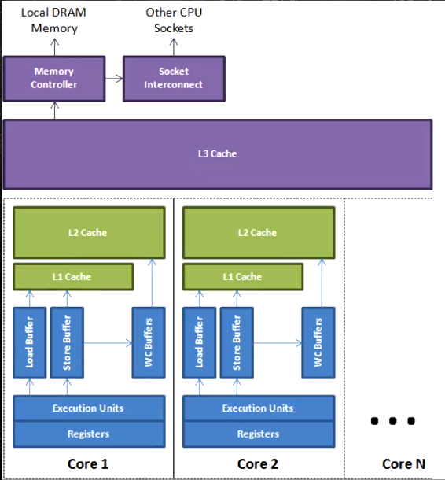
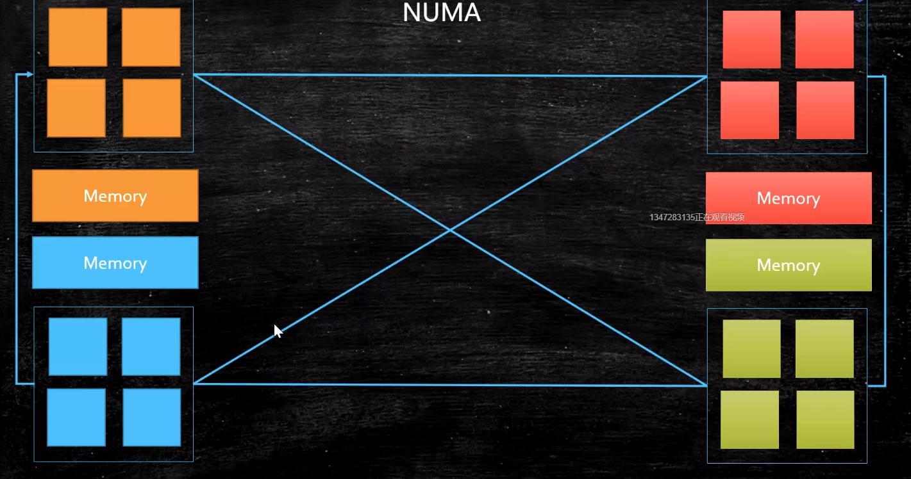
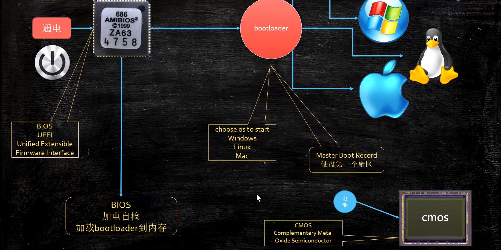

1. CPU组成:
    - PC: Program Counter, 程序计数器；告诉CPU下一条该执行指令的内存位置
    - Registers: 暂时存储CPU计算需要用到的数据
    - ALU: Arithmetic & Logic Unit, 逻辑运算单元，是CPU计算的核心
    - CU: 控制单元
    - MMU: Memory Management Unit，内存控制单元，管理内存
    - cache:
        - 缓存分级:  L1, L2, L3
            - L1, L2是可以看作是CPU各核内的缓存
            - L3可以看作是整个CPU的缓存，各核共享
        - 缓存行: CPU读取数据的最小单位(局部性原理)
            - Jdk1.8之后提供了`@Contended`注解，可以保证
            多个加了注解的`field`不会在同一缓存行内，从而
            避免伪共享问题
        - MESI协议
    
2. CPU一些特性:
    - 乱序执行: CPU为了提高程序效率，可能会先运行后面的指令
        - CPU层面，禁止乱序的一些方式:
            - lfence, sfence, mfence
            - lock(volatile的实现原理)
        - JVM层面:
            - 四种内存屏障: SS,SL,LS,LL
            - 八条happens-before原则
    - 合并写: WCBuffer
        
    - NUMA: Non Uniform Memory Access
        
        - 每个CPU Group，都会优先使用离该组最近的内存

3. 计算机启动过程:
    
    - BIOS检查硬件连接
    - BIOS加载`bootloader`到内存，`bootloader`在磁盘中，
    位置固定
    - `bootloader`选择要运行的操作系统
    - 相应操作系统接收到信号，将自己的启动程序load到内存中的
    固定位置
    - CMOS作用: 保存计算机的一些数据，并且这些数据不会随着断电
    而失效；使用电池来持续供电