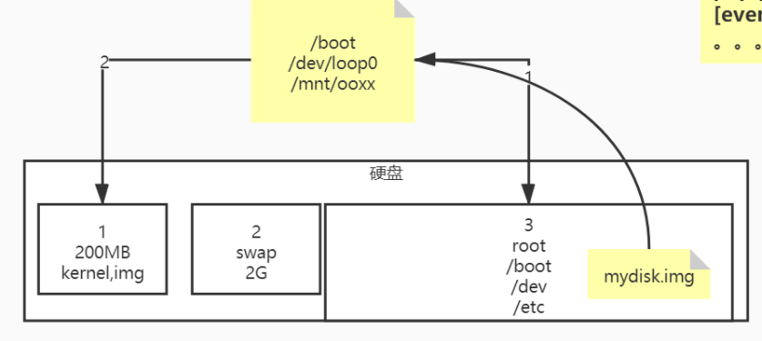
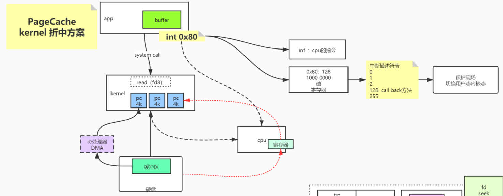

1. 计算机系统预览:
    - CPU
    - 内存
    - IO设备
        - 内核程序
            - VFS: Virtual File System, 树状结构
            - FD: 文件描述符
                - inode: 文件的唯一标识符
                - page cache: 页缓存，读取的最小单位
                - dirty: 被程序修改过的page cache 属性
                - flush: 将脏页刷到内存的过程
        - 用户程序
        
2. VFS:
    - 挂载与一切皆文件:
        
        - Linux中一切皆文件，包括所有的IO设备
        - 当需要使用到IO设备中的数据时，可以将IO设备
        挂载到VFS中的某个目录
    - Linux 文件类型:
        - `-`: 普通文件
        - `d`: 目录
        - `l`: 连接，包括硬连接与软连接(通过`ln`命令创建)
        - `c`: 字符设备，CHR，读过的数据不能再读
        - `b`: 块设备，磁盘就是块设备，块上数据随便读
        - `s`: socket，代表socket连接的文件
        - `p`: pipeline，代表管道的文件，`|`
          
3. Linux中的文件描述符，与输入输出重定向:
    - 0: 标准输入
    - 1: 标准输出
    - 2: 错误输出
    - \>: 输出重定向
    - \<: 输入重定向
    - &: 后接文件描述符
    
4. 一些Linux命令:
    - lsof: 输出当前进程的所有文件描述符的详细信息
    - dd: 创建镜像
    - losetup: 将文件挂载到设备上
    - mount: 挂载
    - umount: 卸载
    
5. PageCache:
    
    - 中断: 
        - 硬件或软件发出中断信号，向CPU提供自己设备
        相应的文件描述符
        - CPU根据所提供的数字(文件描述符)，查询中断
        向量表，决定该执行的程序
    - DMA: 
        - CPU是计算机的心脏，理论上所有行动都要经过它
        - 使用CPU的寄存器来复制数据，效率过低
        - 加新的设备DMA，通过DMA将数据从磁盘复制到内存，
        CPU只需要在合适的时候调度DMA就可以了
        
6. 用户态IO过程:
    - 用户IO -> 内核IO -> 磁盘
    - 用户IO -> 内核IO:
        - 通过mmu，将线程的线性地址转化成物理地址
        - pageCache指的是内存中的页
        - 多个线程可能会指向同一个pagecache
        - pagecache，页缓存，是为了减少磁盘物理IO而存在的
        - pagecache可能带来的问题:
            - 内存刷盘不及时，可能造成丢数据
            - 一些脏页刷盘的相关参数:
                ```
                  vm.dirty_background_ratio: 内核 -> 磁盘刷盘百分比
                  vm.dirty_ratio: 进程 -> 内核传送百分比
                  vm.dirty_writeback_centisecs: 内核 -> 磁盘回写时间
                  vm.dirty_expired_centisecs: 脏页存在最大时间
                ``` 
            - page cache 淘汰策略
         
7. Java的IO相关:
    - 普通的`InputStream/OutputStream`: 每次`write`或者`read`都会调一次
    系统调用，内核态用户态切换频繁
    - `Bufferedxxx`: 内部维护一个缓冲区，`write`或者`read`满缓存区之后，才会
    一起调用系统调用，默认是`8kb`
    - `ByteBuffer`: 
        - Java NIO
        - 可以使用`allocate`分配Java堆内的`ByteBuffer`，
        也可以使用`allocateDirect`分配Java堆外的`ByteBuffer`
        - 三个属性: mark, limit, capacity
        - 通过`filp`转换读模式，`compact`转换写模式
    - `RandomAccessFile`: 随机访问NIO
    - `Channel`和`MappedByteBuffer`:
        - mmap系统调用的`ByteBuffer`
        - 只有`FileChannel`才能通过`map`进行`mmap`系统调用
        - Java的`mmap`本质还是没有逃脱`page cache`的刷盘过程，只是
        减少了`进程 -> 内核`的态切换