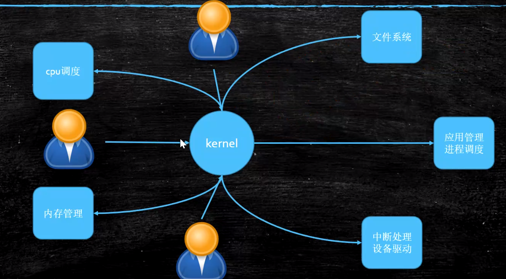
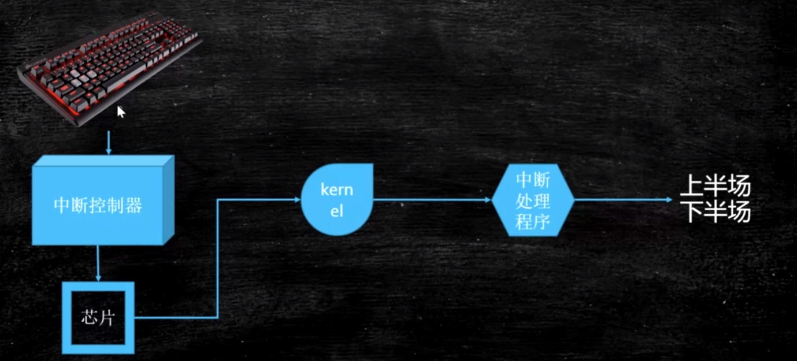

1. 内核分类:
    
    - 宏内核: 现代PC，智能手机的CPU内核，将大部分的主要功能
    都集中在一个内核上
    - 微内核: IOT时代的CPU内核，将各个功能模块切分出来，拥有
    很好的可扩展性
    
2. Linux Ring Level:
    - 0: 内核态
    - 3: 用户态
    
3. 进程，线程与纤程
    - 进程: 操作系统分配资源的基本单位，拥有独立的内存空间
    - 线程: 操作系统执行调度的基本单位，同一进程内的各线程
    共享空间
    - 纤程: 用户态的轻量级线程，所有切换，调度都在用户态中
    进行
    
4. 僵尸线程，孤儿线程:
    - 僵尸线程:
        - 在Linux中，线程的实现方式:
            - fork一个子进程，该子进程与其它子进程共享空间
        - 僵尸线程指那些已经执行完毕，但在父进程中仍留名的线程
        - 具体是，父进程中索引表中，仍能够找到僵尸线程
    - 孤儿线程:
        - 父进程已经被kill掉的线程
        - 被kill掉的父线程的孤儿线程，会重新找到一个父线程
        - 如果在图形化界面中，所有线程的父线程是图形化相关的线程
        - 图形化的父线程是1号线程
     
5. Linux进程调度策略:
    - 进程分类:
        - 实时进程:
            - 优先级排序
            - 高优先级的进程优先执行(FIFO)
            - 同一优先级的进程顺序执行(RR-Round Robin)
        - 普通进程
            - 采用`CFS`(Completable Fair Schedule)
                - 进程之间按时间片划分各自执行的时间比例；
                - 当前需要执行的普通进程会执行相应时间片，但
                处于阻塞状态的普通进程不会被CPU分配时间片
                - 当阻塞状态的普通进程不再阻塞后，CPU会根据其
                实际执行时间，为其优先分配资源
           
6. 中断:
    - 硬中断:
        
        - 硬件层级发出请求，需要CPU响应中断
        - 中断控制器收到信号，发送相关信号给CPU
        - CPU调用操作系统内核程序，执行中断处理程序
        - 内核态执行上半场
        - 用户态执行下半场
    - 软中断:
        - 用户态程序进行系统调用时，对CPU发起的中断
        - 将发起的系统调用号放入`eax`寄存器中
        - 将系统调用所需要的各个参数，放入`ebx, ecx, edx, esi, edi`寄存器中
        - 操作系统调用`int 0x80`中断
        - 操作系统内核执行完之后，将返回结果放入`eax`寄存器中
    
7. 内存管理:
    - 内存管理需要解决的两个问题:
        - 内存空间不足
        - 进程间数据的相互干扰
    - 内存空间不足:
        - Linux采用`段页式`的内存管理方式
        - 分页:
            - 内存，磁盘都被分为固定大小的页框(一般为4K)，
            用到哪一块，加载哪一块
            - 加载的时候，如果产生缺页中断，并且内存已满，
            会执行页面置换算法(最常用: LRU, Leetcode146题)
            - 被置换出去的页，放入磁盘的`swap`分区
    - 进程间数据相互干扰问题:
        - 虚拟内存: 从进程的角度看，该进程独占了整个系统 + CPU
        - 每个进程都拥有自己的虚拟内存空间
            - 大小: 64位机器，寻址空间为`2^64 Bytes`
        - 虚拟内存与物理内存的映射:
            - 偏移量 -> (+页号, 段号)线性地址 -> (OS + MMU)物理内存
         
8. ZGC颜色指针与寻址空间的关系:
    - GC信息不再记录在对象头，四个颜色指针记录在地址(指针)上
            
            