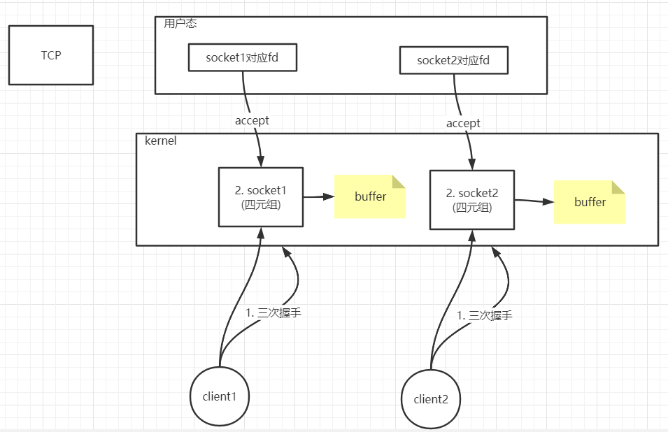
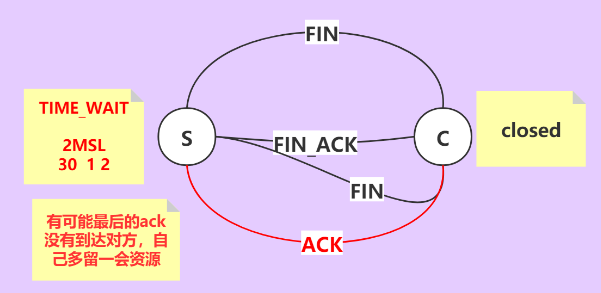
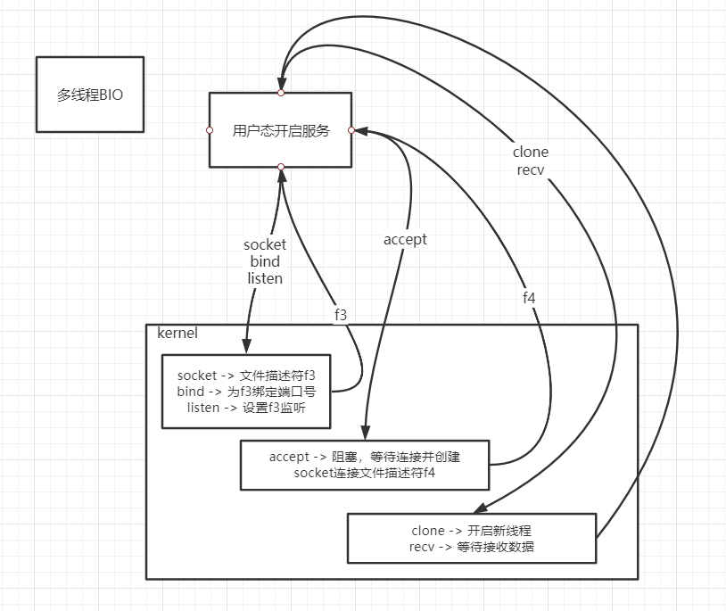
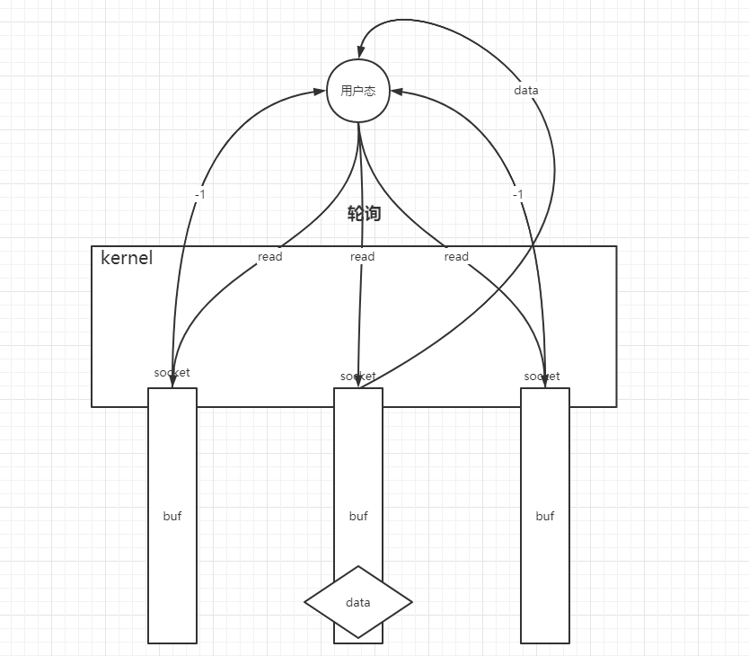
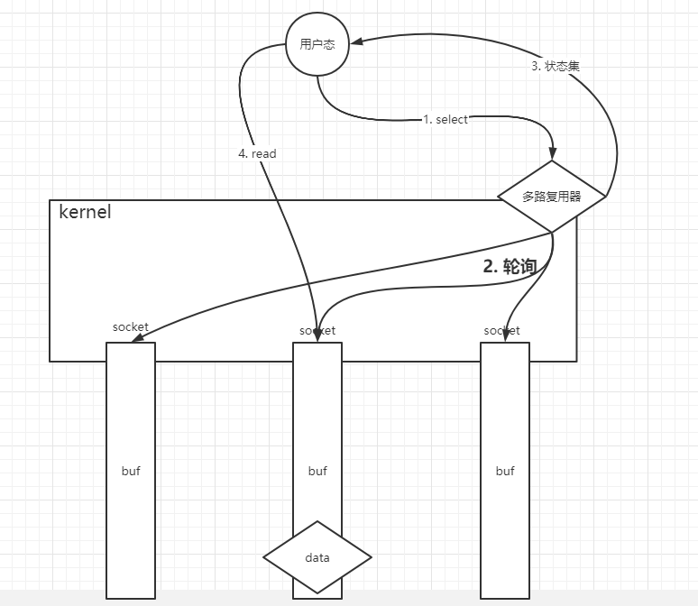
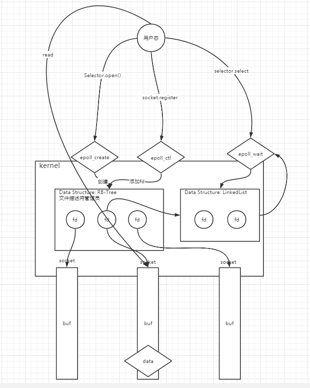
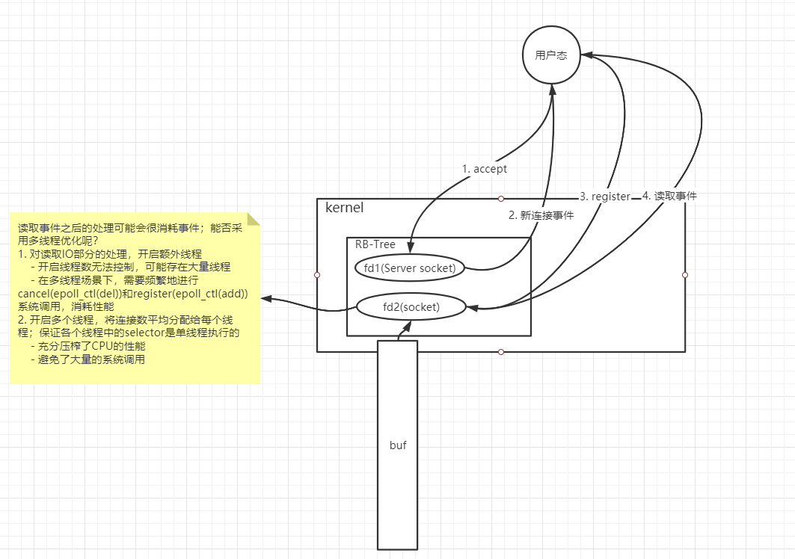

1. TCP在网络IO和OS中的模型:
    
    - 客户端发送连接请求
    - 内核负责与客户端进行三次握手，并建立连接
    - 用户进程进行`accept`系统调用，获取连接
    对应socket的文件描述符
    - 用户进程使用文件描述符进行相关网络操作
    
2. 一些TCP的相关参数:
    - ServerSocket相关参数:
        - `so_timeout`: `accept`系统调用阻塞的时间
        - `back_log`: 最多可以支持的连接数(全连接队列)
    - Socket相关参数:
        - `keepalive`: true/false，true时，会定期通过连接
        向客户端发送心跳，保证连接有效
        - `so_timeout`: 客户端连接过期时间
        - `rec_buf/send_buf`: 接收/发送缓冲区
        - `no_delay`: true/false，是否等待；
            - true: 不等待，对一个很长的包，可能会迫不及待发出；
            导致一个`< 1500 bytes`的包可能会被分成很多份
            - false: 默认状态，会等待其他包一起组成一个更大的包
            再通过网络发送
    - TCP四次分手的状态分析:
        
        - 为什么需要四次分手？
            - 接收分手的一端需要时间处理剩余事情之后，才能释放资源
            - TCP是面向连接的协议，有发送必有回应
        - 最后发送断开连接的一端，需要进入`2MSL`的`TIME_WAIT`
            - 保证网络上不再有之前`socket`的残留包
    
3. 多开启服务并多线程监听端口的过程:
    
    - 用户进程开启服务
        - `socket`系统调用，创建`ServerSocket`连接，
        获取相应文件描述符
        - `bind`系统调用，对`ServerSocket`绑定端口
        - `listen`系统调用，开启端口监听
    - 用户进程开始监听用户连接到达
        - 使用`accept`系统调用，此系统调用是阻塞的；
        成功之后返回连接对应`socket`的文件描述符
    - 使用`clone`创建新用户线程，负责该连接的使用
   
4. 网络IO模型演变:
    - BIO -> 普通NIO -> select多路复用 -> epoll多路复用
    - 普通NIO:
        
    - select多路复用:
        
    - epoll多路复用:
        
    - Java中关于多路复用的API:
        - Selector: 多路复用选择器
            - open:
                - select, poll: 创建jvm中的文件描述符数组
                - epoll: 相当于`epoll_create`
        - socket.register(): 相当于`epoll_ctl`
        - selector.select(timeout): 相当于`epoll_wait`
        - SelectionKey: 相当于文件描述符对应的socket
    
5. 多线程selector模型:
    
    - 对于`write`，一般会在以下两种情况都满足的情况下开写:
        - 用户想写，一般是在`read`之后
        - TCP的`send-queue`还有剩余空间
    - `write`调用完之后，应及时`cancel`，否则文件描述符(SelectionKey)
    会一直`WriteAble`