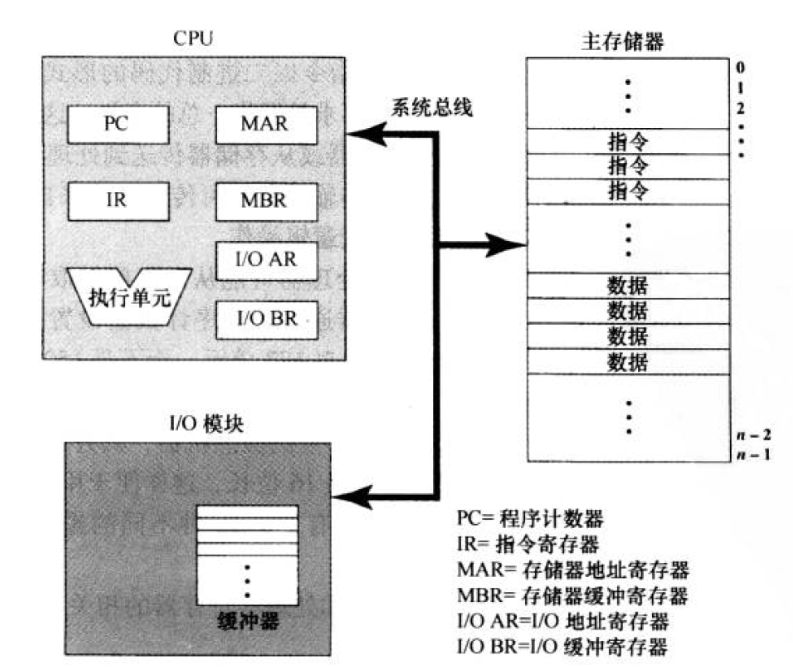
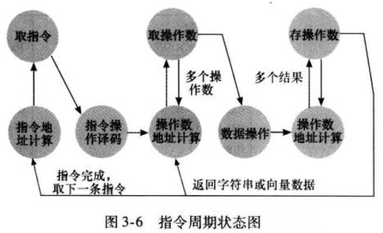
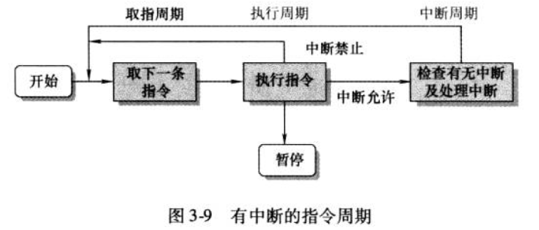
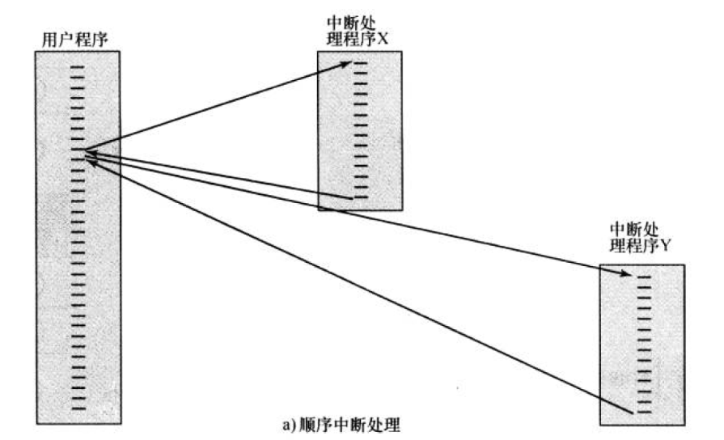
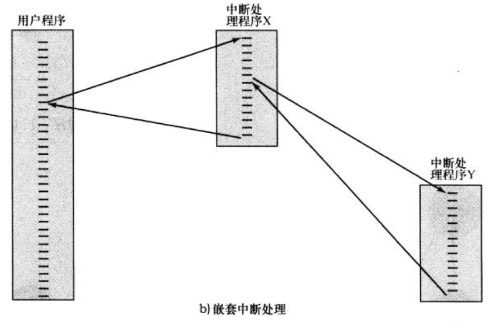
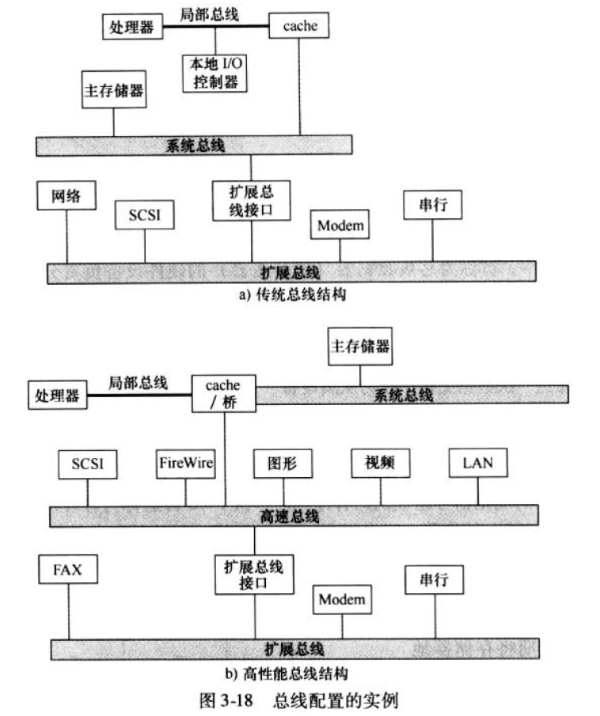

1. 冯诺依曼体系计算机组成:
    
    CPU负责处理任务，存储器存储数据与相关指令，IO模块与外设交互
    
2. 指令，取指周期与加入中断后的取取指周期
    
    
    - 为什么需要中断？
        
        有一些指令可能需要I/O操作等耗时操作，会让CPU在此期间处于空闲状态，
        降低了CPU的利用率
    - 多重中断的存在与处理:
        - 顺序中断处理
        
        - 嵌套中断处理(带优先级)
        
        
3. 总线分类:
    - 系统总线:
        - 地址总线
        - 数据总线
        - 控制总线
    - 高速总线: 连接处理器cache与高速IO设备
    - 扩展总线: 连接IO处理模块与慢速IO设备
    
4. 多层次总线结构:
    
    
5. 总线设计要素:
    - 类型:
        - 专用总线
        - 复用总线: 如地址和数据用同一套总线
    - 仲裁方法: 同一套总线上可能连接多个设备，可能有多对设备需要通信，这时候需要仲裁
        - 集中式: 由仲裁器负责分配总线时间
        - 分布式: 每个设备内包含访问控制逻辑，各个设备共同起作用
    - 时序:
        - 同步: 完全取决于时钟，各个时间点开始什么任务已经固定
        - 异步: 灵活安排，前一个任务开始了或者前一个任务做完了，就可以开始下一个任务了