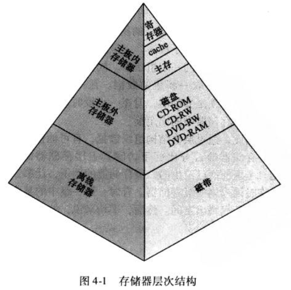

1. 存储器中的一些基本概念:
    - 按存储位置为存储器分类:
        - 内部存储器: cache，主存，寄存器等
        - 外部存储器: 磁盘，光盘，磁带等
    - 传送单元: 字/块，像磁盘就以扇区为单位传送数据
    - 存取方法:
        - 顺序存取 
        - 直接存取
        - 随机存取: 采用地址-内容映射的方式
        - 关联存取: 采用内容hash-内容映射的方式
    - 物理特性
        - 掉电易失/非易失
        - 可擦除/不可擦除
   
2. 存储器金字塔:
    
    - 一切都是速度，容量，成本的衡量
    
3. cache存储器原理与基本概念:
    - cache与主存的关系:
        
    - 基本概念:
        
        - 主存: 以字节编址
            - 字: 若干个字节组成一个字，看机器
            - 块: 若干个字组成的一个多字单位
        - cache:
            - 行: 相当于主存的块，每行包含了块中的所有字以及一些标记
            - 行号
            - 标记: 行中标记，可与主存中的块作映射
    - cache读过程与典型的cache组织(使未缓存数据并行读入的组织方式):
        
        
4. cache设计要素:
    - cache存取地址:
        
        - 逻辑地址: 更快，但是多进程可能会发生cache冲突
        - 物理地址: 稍慢，不冲突；更常用
    - 映射方式:
        - 直接映射: 直接对块号取模映射到cache中
            - cache行标记: s - r
                - 2^s == 块号范围
                - 2^r == cache行数量
            - 主存中各块映射到cache中的位置，在任何时候都是固定的；
            因此很容易产生扰动现象(两个常用的块，映射到cache中后在同一个位置)
        - 全相联映射: 主存各块映射到cache中的位置是不固定的
            - cache行标记: s，就是主存块号
            - 缺陷: 主存行存取的行标记可能特别长
        - 组相联映射: 结合直接映射和全相联映射
            - 将整个cache分成v组
            - 主存各块映射到cache组的过程使用直接映射算法
            - 在cache组内部，使用全相联映射的方式
            - cache行标记: s - t
                - 2^s == 块号范围
                - 2^t == v
    - 替换算法: 缓存满了之后，新缓存行替换旧缓存行的算法，一般采用LRU
    - 写策略: 缓存与主存的一致性问题；多处理器场景下，不同处理器缓存一致性问题 
        - 写直达(write through): 所有写操作对cache和主存同时进行
        - 写回法(write back): 将缓存数据刷回主存时，才对主存数据进行覆盖；需要
        额外的脏位标记
    
5. 内部存储器常用的SRAM和DRAM:
    - SRAM: 静态RAM，速度快，价格昂贵，主要用来实现cache
    - DRAM: 动态RAM，速度相对DRAM慢，价格稍便宜，主要用来作主存
    
6. 主存中的纠错算法(海明码纠错):
    - 纠错使用: 新旧校验码进行异或
    - 如何判断某位校验码校验哪些位?
        
        某一位对应的下标(从右往左)，需要该校验码位对应的下标组成(2^k)
    - 为什么新旧校验码异或完之后可以纠正单位错误？
    
        根据第二个问题的答案，假设其中任意一位发生变化，在纸上画画看
        
7. 磁盘存储结构:
    - 磁头: 可径向移动，之后扇区旋转而磁头不动，可读某磁道上的数据；以扇区位单位读
    - 底盘