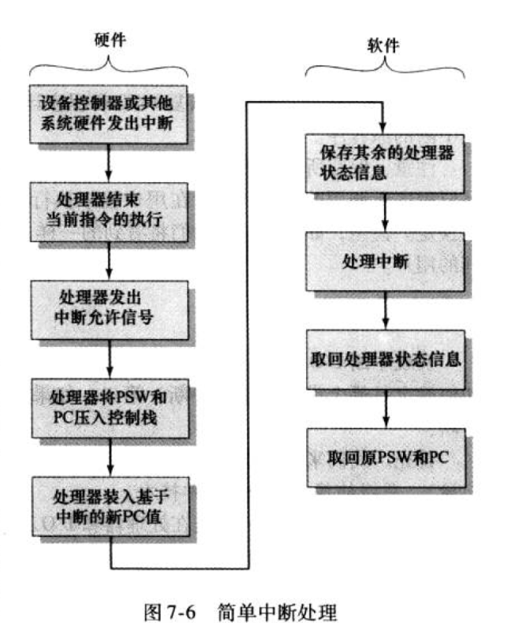

1. I/O模块功能:
    - 作为处理器与外部设备的桥梁，负责两部分的通信与数据缓冲
    
2. 三种基本I/O操作:
    - 编程式IO: 所有数据都要经过CPU存入内存，并且CPU在IO过程中不断主动轮询IO状态
    - 中断式IO: 所有数据都要经过CPU存入内存，CPU在IO过程可进行其它操作，之后由IO设备发起中断信号
    - DMA: CPU将数据存储的任务交给DMA，所有数据通过DMA存入内存；存完后DMA通过中断通知CPU
    
3. IO命令基本分类:
    - 控制命令: 激活外设并告诉它要做什么
    - 测试命令: 测试与IO模块及其外设相关的各种状态条件
    - 读命令
    - 写命令
    
4. IO模块编制方式:
    - 存储器映射式IO: 与存储器共用一套，会逻辑切分；比如1024个寻址位置，
    前512个是存储单元的，后512个是IO模块的
    - 分离式
    - 比较:
        
        存储器映射式可用的指令更多，但相对消耗存储空间；分离式相对IO指令少了很多
        
5. 中断式IO的中断详细过程:
    