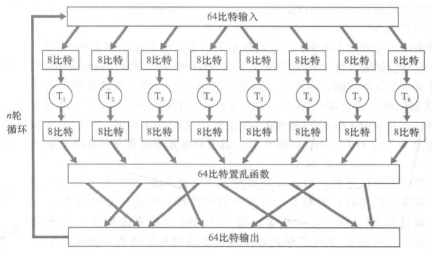
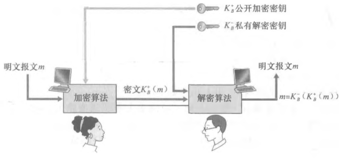
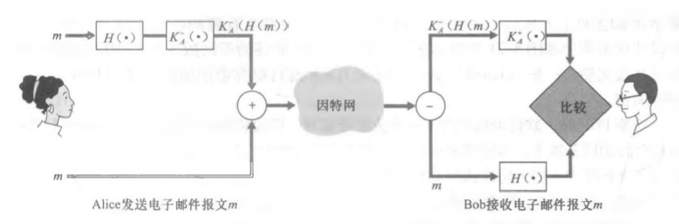
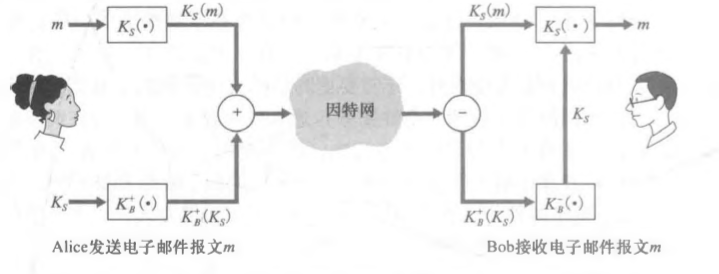
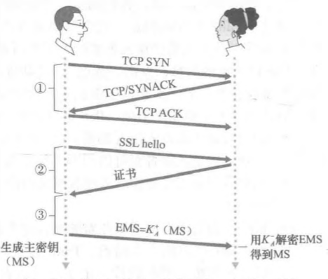
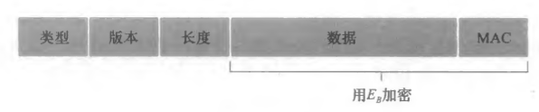

1. 安全问题:
    1) 报文机密性: 报文有被窃听风险，如何在被窃听的情况下，
    保持报文的机密性
    2) 报文完整性: 报文有被拦截风险，如何在被拦截情况下，
    保证拦截方对报文做的一切手脚都能被发现
    3) 端点检测: 网络中任意双方该如何进行身份鉴别
    4) 服务器的运行安全性
    
2. 广泛应用的密码学原则:
    1) 机密性的保证: 数据加密
        1. 数据加密的两种体系:
            ````
           1. 对称加密:
                1) 流密码
                2) 块密码
           2. 公钥加密: 公私钥
           ````
        2. 对称加密中的块密码与CBC技术:
            1. 块密码定义:
            将待加密的报文分成多个n比特块，每个比特块都通过
            相同的一张“n比特 -> n比特”表进行映射，得到最后
            的加密密文；密钥即为此映射表
            2. 块密码的问题:
                - 比特块较小时，安全性不足
                - 比特块较大时，密钥存储空间非常大
                - 各个块，只要他们的比特排列是一样的，最终密文也是相同的
            3. 密钥替换 - 函数模拟排列表: 块内再分块
                
            4. 密码块连接(CBC): 解决各个相同块最后密文一样的问题
                - 发送方随机生成一个初始随机向量，称为IV，记作c(0)
                - 第一个块密文: c(1) = Ks(m(1) ^ c(0))
                - 第二个块密文: c(2) = Ks(m(2) ^ c(1))
                ...
                - 发送方仅需将IV发送给服务器端，而服务器端则拥有之后
                每一个块计算的随机向量；有效地解决了问题，同时也避免了
                为每个块都单独生成一个向量并且传输该向量的网络开销
                
        3. 公钥加密:
            
            - 发送方用接收方公钥加密，接收方用自己私钥解密
            - 公钥加密常用算法: RSA
            - 使用RSA的几个注意点:
                - RSA算法中使用了大量指数运算，所以整个加解密过程非常耗时
                - 为了加速加解密过程，常常会使用将原报文哈希成一个固定位数
                哈希值，再对此哈希值加解密的技巧
                - 算法原理中包含许多数论知识
          
        4. 对称加密与公钥加密结合 -> 会话密钥:
            1) 对称加密与公钥加密的问题:
                - 对称加密本身需要发送方和接收方都具有相同的
                密钥，此密钥的发放是个问题
                - 公钥加密计算慢
            2) 为了解决各自的弊端，可以通过公钥加密
            将对称加密的密钥进行加密并传送，之后使用
            对称加密的方式进行消息传输；
        
    2) 报文完整性保证: 报文未被删减，篡改
        1. 哈希算法使用: MD5或SHA-系列
        2. 报文鉴别码(MAC, Message Authentication Code)原理:
            1. 使用技巧: 哈希函数与鉴别密钥(对称加密)
            2. 步骤:
                - 发送方对报文m与鉴别密钥s级联，对级联后的数据
                通过哈希函数得到散列H(m + s)，此即为MAC
                - 发送方发送报文(m, H(m + s))
                - 接收方通过比较自己生成的MAC与接收到报文中的MAC
                是否相同，来判定报文的完整性
            
    3) 端点检测:
        1. 非对称加密中的端点检测: 数字签名
            1. 数字签名的含义: 相当于互联网中某个用户的唯一身份证
            2. 使用什么媒介来作为数字签名？
                - MAC? 否，因为MAC中的密钥s被两方所拥有
                - 私钥+公钥? yes
            3. 数字签名中CA(权威认证机构的引入，相当于中国人民政府对身份证的认证):
                - 若不引入CA，则黑客可以将身份证改作自己的身份证，
                但声称自己是正常用户，从而冒充正常用户
            4. 公钥加密+数字签名的过程:
                1. 发送方使用自己的私钥对即将发送的报文进行加密，将
                密文嵌到发送报文中；
                2. 发送方将从CA得到的身份证书(发送方公钥 + CA给发送
                方指定的唯一编号，相当于身份证)嵌到发送报文
                3. 发送方发送数据
                4. 接收方接收数据
                5. 首先提取发送方身份证信息，并向CA确定发送方身份(端点
                检测发生位置)
                6. 使用身份证中的公钥解密数据，与报文比较，再次验证发送
                方身份(二次端点检测)
                7. 使用自己的私钥解密报文数据
        2. 对称加密中的端点检测: 不重数
            1. 使用IP验证身份: 无法避免IP哄骗
            2. 使用发送方专有口令: 口令可被盗取，并被冒用
            3. 使用密钥加密口令: 加密口令被截取直接使用，
            无法避免回放攻击(指攻击者事后使用加密口令冒充
            发送者)
            4. 不重数: 相当于变化的口令，由服务端发给客户端，
            客户端使用密钥对不重数加密，服务段解密之后与自己
            的不重数比较从而进行端点检测
            5. 不重数是否可以被运用到公钥加密？可以，但没必要；
            因为最终还是免不掉CA的存在
            
以下为计算机网络中对上述密码学原则的应用:
1. 安全电子邮件: 使用会话密钥，MAC，数字签名
    1. 先保证报文完整性与端点检测:
        
        - 报文m通过哈希函数与密钥，变成MAC
        - 将MAC通过数字签名步骤，变成身份证
        - 将身份证与原始报文m合并，生成报文(I)
    2. 进一步保证报文机密性
        
        - 使用会话密钥的对称加密密钥加密报文
        - 使用非对称加密的接收方公钥加密对称加密密钥
        - 将两部分组织好，生成最终报文
        
2. SSL原理: 在TCP协议之上，实现的安全协议
    1. 实现在运输层，意味着传输的报文是需要被分段传输的；
    因此加密的过程，是对完整报文的各个段进行单独加密的
    2. 宏观类SSL过程:
        
        - EMS为生成传输过程主要密钥的key
            - Eb: 发送方对报文加密的会话加密密钥
            - Mb: 发送方生成MAC使用的密钥
            - Ea: 接收方发送报文使用的会话加密密钥
            - Ma: 接收方生成MAC使用的密钥
        - 由于TCP包的序号对黑客可见，因此为了避免TCP包
        被黑客手动调换顺序，需要在SSL概念内维护一个额外的
        序号，此序号被包含于报文中，计算MAC也当然会被一起计算
    3. 实际SSL的握手过程:
        1. 客户发送己端支持的密码算法列表，并带上客户不重数
        2. 服务器选择密码算法，并将自己的证书和服务器不重数合并，返回给客户
        3. 客户生成PMS，将PMS使用服务器公钥加密后发送给服务器
        4. 客户端和服务器分别使用PMS生成所有交互过程需要的密钥
        5. 客户端发送所有握手报文的一个MAC
        6. 服务器发送所有握手报文的一个MAC
        
        ▲ 握手过程5，6步的必要性: 由于前几步是透明的，未进行任何加密，
        因此欠缺机密性与完整性；第5，6步可防止篡改
        
        ▲ 第1，2步不重数的必要性: 失去不重数意味着失去了端点检测，
        黑客可之后使用之前窃听的包重新对服务器发起请求冒充客户
        
    4. SSL记录结构:
        
    
    5. SSL断连: 需要在SSL记录的类型字段作出说明，否则
    可能会有被截断攻击的风险(黑客提前发出FIN包断开TCP连接)