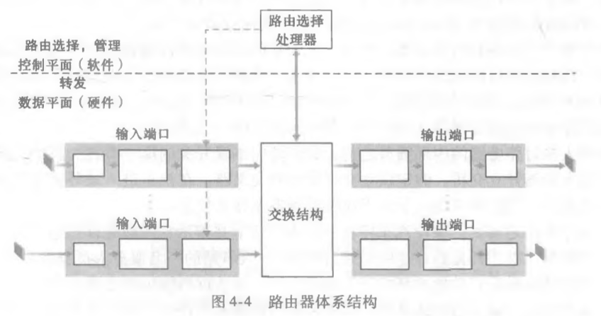
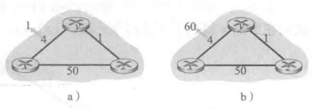
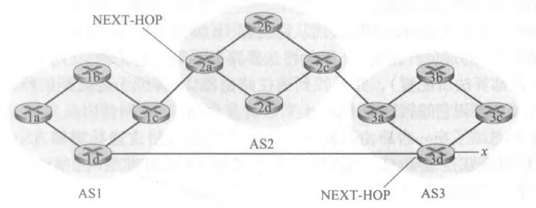
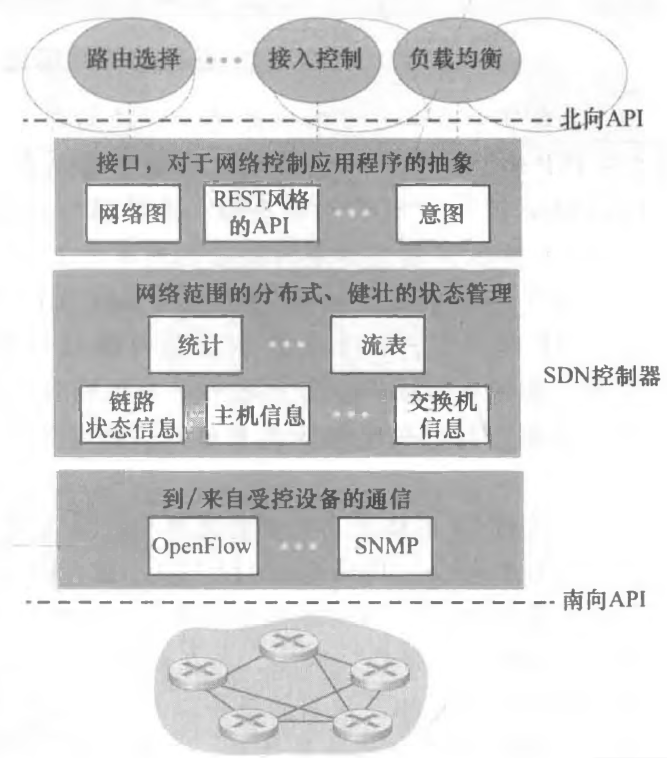

1. 网络层功能概述:
    - 数据平面: 根据路由表/流表转发数据包
    - 控制平面: 路由表计算，状态维护管理...

2. 网络层服务: “尽力而为”
    - 确保交付
    - 具有时延上界的确保交付
    - 有序分组交付
    - 确保最小带宽
    - 安全性
    
3. 路由器工作原理:
    
    1. 转发: 
        - 基于目的地址转发: 以目的地址为根据转发
        - 通用转发: 根据报文流，而不止是网络层字段转发
    2. 输入端口负责转发到交换结构: 范围匹配/最长前缀匹配
    3. 交换结构:
        - 经内存交换:
            - 早期处理器控制，每次只能转发一个数据包而不管有多少个输入端口
            - 引入输入线路卡，将数据包引入内存，因此可多线操作
        - 经总线交换: 共享总线方式，一次只能转发一个数据包
        - 纵横式网络: 交叉点，对于不同输入端口转发到不同输出端口的数据包，
        可以同时转发
    4. 排队问题:
        - 输入排队: HOL问题
        - 输出排队: 缓存满了之后的丢弃策略
    5. 排队调度问题:
        - FIFO: 先进先出
        - 优先权排队: 非抢占式
            - 不同的输出链路优先权类
            - 优先调度高优先权类
        - 循环和加权公平排队:
            - 每个单位时间，调度一个优先权类的数据包
            - 保持工作排队原则: 在某个单位时间应该调度的
            优先权类中没有数据包时，会依次调度下级优先权类
            数据包
            - 加权公平: 
                - 每个优先权类分配一个权重wi
                - 第i类将被确保服务时间至少为: wi/(w1+w2+...+wn)
                - 保证了带宽利用
                
4. IP协议:
    - IPv4: 
        1. 报文格式:
            ````
           版本  首部长度   服务类型   数据报长度
           16比特标识      标志   13比特片偏移
           寿命      上层协议     首部检验和
                    32比特源IP地址
                    32比特目的IP地址
                    选项
                    数据
           ````
           - 版本: 说明该报文为IPv4
           - 首部长度: 如果没有选项字段，则为20字节
           - 服务类型: 实时性要求高的数据包/实时性要求低
           - 16比特标识，标志，13比特片偏移: 数据包分片相关字段
                - 标识: 表示同一个大数据包的序号
                - 标志: 是否是某个数据包中的最后一个分片
                - 偏移: 分片在数据包中的字节偏移量，以便以正确顺序组装
           - 寿命: 路由器TTL
           - 上层协议: 运输层使用的相关协议/ICMP等
        2. DHCP协议(Dynamic Host Configuration Protocol):
            - 为加入子网的主机动态分配一个IP地址
            - DHCP过程: 是一个客户-服务器程序
                - 新到达主机以广播形式，发送DHCP发现报文
                (源IP为0.0.0.0，目的IP为255.255.255.255)
                - DHCP服务器将报文的事务ID，向客户推荐的IP地址，
                网络掩码以及IP地址租用期
                - 客户从多个服务器接收到回应，选择一个最优的服务器，
                发送DHCP请求报文进行回应，回显配置参数
                - 服务器发送DHCP ACK响应客户端
        3. NAT(网络地址转换)协议: 用于专用网络的网络通信
            - 子网内部将数据包发送到网关路由器(中间盒)
            - 网关路由器将数据包源地址改变为自身IP，端口号
            随机选择一个未用的替换原来的，将数据包转发到子网
            外部；并在路由器的NAT转换表中，添加(端口号，IP，初始端口号)
            的条目
            - 网关路由器收到某个发给他自己的数据包之后，查找NAT转换表，
            进行转发
        
    - IPv6:
        1. 报文格式:
            ````
           版本   流量类型    流标签
           有效载荷长度    下一个首部   跳机制
                    源地址(128b)
                    目的地址(128b)
                    数据
           ````
           - 版本: 路由器识别IPv6报文的依据
           - 流量类型: 高实时要求的报文/低实时要求的报文
           - 下一个首部: 标识数据包中的内容需要交付给上层哪个协议/
           - 跳限制: TTL
           - 相比IPv4，把分片/首部校验和等字段删去了，并且
           选项字段内嵌到"下一个首部"概念中
           
控制层:
1. 两个原理算法:
    1. 集中式路由选择算法:
        1. 原理
        - 对于每一个路由器，都具有该网络内的所有完整信息
        - 每一台路由器，都独立进行路由计算
        - 典型代表: 链路状态(LS)算法
        2. 链路状态算法:
            - 每台路由器:
               - 包含整个网络链路开销信息
               - 会周期性/一旦变化地向网络内其它路由器
               广播链路开销信息
               - 独立运行Dijkstra算法
            - 算法复杂性: O(nlogn)，收敛快
            - 算法缺陷: 
               - 链路开销变化时，会广播并重新运行算法；
               这可能导致振荡现象(例如，算法路由结果不断
               在两条路径直接切换)
               - 当网络路由器数量非常大的时候，数据交换
               成本非常高 
        
    2. 分散式路由选择算法:
        1. 原理:
        - 路由器以迭代，分布式的方式计算出最低开销路径
        - 没有节点拥有关于所有网络链路开销的完整信息
        - 典型代表: 距离向量(DV)算法
        2. 距离向量算法: Bellman-Ford方程(松弛)
            - 每台路由器:
                - 维护自身的距离向量，具体是:
                    `[D(1), D(2), ..., D(n)]`
                   其中D(x)为该路由器与路由器x之间的
                   估计路径开销
                - 保存所有相邻路由器的距离向量
                - 利用相邻路由器的距离向量计算自身的距离向量，
                当其发生更新时，将距离向量广播发送给所有相邻路由器
                - 当相邻链路开销发生变化时，更新自身的距离向量
            - 链路开销发生变化的情况:
                
                a) 正常计算
                
                b) 可能发生"黑洞"，y与z的值不断更新很多次，每次增加1，
                直到更新的值超过指定值才达到正确状态；可使用“毒性逆转”
                方式解决，但是仅能解决y和z这样相邻的情况
              
    3. LS算法与DV算法比较:
        - 数据交换复杂性: LS算法需要整个网络之间互相广播，
        而DV算法仅需与邻居进行数据交换
        - 收敛速度: LS算法执行频繁；DV算法收敛较慢，并且
        会有无穷计数问题(上面的(b)情况)
        - 健壮性: LS算法各路由器计算分离，一定程度提供了健壮性；
        而DV算法中一台路由器的错误计算，会影响整个网络
            
    4. 从三方面来讨论一个路由算法:
        1. 分布式or集中
        2. 动态或静态: 能否根据网络状况变化动态执行
        3. 负载敏感: 拥塞控制相关
            
2. 自治系统(AS)内路由选择: OSPF
    - 自治系统: 整个因特网中涉及主机数量非常多，在这种情况
    下任何一种算法都不太能很好地工作；而因特网可由多个ISP管理，
    因此可以将因特网按照ISP划分成多个自治区域，每个自治区域当然
    可以进行进一步划分
    - OSPF算法:
        - AS内所有路由器掌握网络内完整链路信息，并运行Dijkstra算法
        - 链路开销由网络管理员预先设置
        - 特点:
            - 安全，路由间数据信息转发会进行数据鉴别(MAC)，也会使用
            不重数防范重放攻击
            - 多条路径开销相同时，会进行策略选择而不是死板地只选其中一条
            - 支持在单个AS中的层次结构，一个OSPF自治系统能够层次化地配置
            多个区域，每个区域都运行自己的OSPF算法
            
3. ISP之间的路由选择: BGP(Border Gateway Protocol)
    - BGP目的:
        考虑一个场景，某个路由器如何将数据传输到与此路由器
        不在同一个AS内的IP呢？
    - BGP路由表条目:
        1. BGP的路由表，存储的不是具体IP，而是CIDR形式的
        子网IP集合，如(138.2.2/24)
    - BGP的任务:
        1. 从邻居AS获得前缀的可达性信息
            
            - BGP连接: 分为内部连接(iBGP)与外部连接(eBGP)；
            内部连接指相同AS中的两台路由器之间的BGP会话；
            外部连接指跨越两个AS的BGP连接
            - AS-PATH: 到AS1，AS2 AS3 x(前缀);可用于检测和防止通告环路
            - NEXT-HOP: 如图，指最近一个AS的入IP
            
        2. 确定到某前缀的“最好的”路由:
            - 热土豆路由选择:
                AS内选择到达NEXT-HOP开销最小的路径
            - 通用性策略路由选择:
                - 路由被指派一个本地偏好值作为其属性之一；
                第一次选择将会选出本地偏好值最高的NEXT-HOP
                - 从余下的路由中，选择具有最短AS-PATH的路由
                (即经过的AS最少)
                - 对剩下的路由，使用热土豆路由选择
                - 根据BGP标识选择
            
        3. 路由表缓存: 在第一次做出"最好的"路由选择之后，
        路由表会将对应的前缀和NEXT-HOP作缓存
     
    - 路由选择策略:
        比较关键的一点是，ISP都不希望自己的网络被别人白嫖；
        所以有"X必定是进入/离开某ISP的所有流量的源/目的地"
    - 从三个方面考虑选择何种AS内/AS间路由算法:
        - 策略: 算法路由选择核心
        - 规模: 网络中的主机数量
        - 性能
     
4. SDN: 控制平面核心实现
    
    - 通信层: 网络控制中心(应用程序)与路由器沟通的桥梁，
    可以接收路由器状态并传输流表给路由器
    - 网络范围状态管理层
    - 网络应用程序API
    