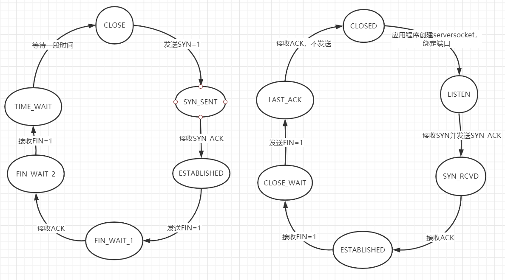

1. 运输层的主要问题:
    - 为应用层提供数据，从应用层接收数据
    - 选择性为应用层提供可靠传输
    - 选择性提供网络拥塞控制
    
2. 运输层与应用层进行数据交换的媒介 -- socket:
    1) 从应用层接收数据: 多路复用
        ````
        1) 运输层中有发送缓存，从应用层拿到的带发送数据
        放在此缓存中
        2) 源主机从不同socket中收集数据块，并为每个数据
        块封装上首部信息(UDP or TCP)，并将报文段传递到
        网络层的过程，叫做多路复用
        ````
    2) 向应用层传送数据: 多路分解
    3) socket结构:
        ````
       1) UDP: 由主机IP与端口号唯一确定
       2) TCP: (sourceIP, sourcePort, tIP, tPort)唯一确定
       ````
    4) socket与进程并不一定是一对一的
   
3. UDP协议概述: 快，节省资源
    1) 无连接的: 意味着传输数据前，不需要创建连接；
    另一方面，会导致UDP接收方socket接收所有发送方
    的数据；是UDP快，节省资源的原因之一
    2) 无拥塞控制: 意味着发送端向外发送数据的速率
    不会受到网络情况影响；可以无限制地发送数据，快
    3) UDP报文结构结构:
        ````
       源端口号   目的端口号
       数据长度   检验和(差错校验)
       应用数据(报文)
       ````
       其中检验和可以用来进行差错校验
    3) UDP相对于TCP的好处
        ````
       1. 无需创建连接，一定概念上减少了数据传输时延
       2. TCP的可靠传输和拥塞控制都会对数据传输时延
       造成影响，而UDP没有这方面的烦恼
       3. 无连接状态，节省了一些创建连接的开销以及
       资源占用，可以空出更多的资源创建更多的UDP socket
       4. UDP首部只有8字节，TCP有20字节
       ````
    4) UDP弊端: 由于其不进行拥塞控制处理，会使得
    网络状况变得非常糟糕，也会挤占TCP数据包的传输
    空间
    5) UDP拓展: 一些情况下，我们需要UDP无上限的发送速率，
    同时需要传输层协议足够可靠，这时候可以在应用层实现可靠
    性传输来实现；Google Chrome的`QUIC`协议就是这样
    
4. 可靠性传输原理:
    1) 底层信道完全可靠，此时不需要运输层做任何可靠传输
    保证
    2) 若底层信道可能发生比特错误
        ````
       1. 发生错误时，需要重传数据包
       2. 发送端如何知道何时需要重传数据包 -> ACK/NAK回复
       3. ACK/NAK回复可能发生比特错误 -> 数据包添加序号，回复时带上序号
       ````
    3) 底层信道可能发生数据包丢失
        ````
       1. 超时重传机制
       ````
    4) 发送-确认停等协议的改进版本 -> 流水线可靠数据传输协议
        ````
       本质是滑动窗口式的协议
       1. GBN: 发送窗口N，接收窗口1
            1) 累计确认，发送的ACK总是确认当前期望的数据包
            2) 单计数器，超时时全部重发
       2. SR: 选择重传，发送窗口N1,接收窗口N2
            1) 选择确认，发送的ACK总是确认当前接收到的数据包
            2) 多计数器，每个窗口位置一个计数器
            3) 可能发生的问题:
                - 窗口错位导致序号重用，引起数据错误
                    因此，窗口大小 <= 1/2序号空间
       3. 滑动窗口协议可能存在的一个问题:
        由于重传的机制存在，网络上可能存在多个序号为x的包，
        但此时，发送端和接收端由于之前的x包已经确认，所以
        其窗口内不含x；如果当其窗口再次包含x，但之前发送出
        的x包未消亡时，会引起数据错乱
       ````
       
5. TCP中的可靠数据传输:
    1) 累计确认: 类似GBN，接收方总是回复当前期望的数据包的序号ACK
    2) 发送方超时不全部重传
    3) 快速重传机制: 当发送端累计收到三个未被确认数据包的ACK时，
    此时不等待超时直接将此数据包重传
    4) 可向TCP中添加选择确认机制
    
6. TCP协议:
    1) TCP报文结构
        ````
       源端口号     目的端口号
            序号
            确认号(ACK)
       首部长度 8个比特位(包含SYN，FIN等) 接收窗口
       校验和                          紧急数据指针
       选项头
       数据
       ````
       a. 序号: 以数据字节标记，加上一个固定随机数
       b. 确认号(ACK): 表示期望的另一端发送包的序号
       c. 接收窗口(rwnd): 用于流量控制
    2) TCP连接管理
        ````
       1. TCP连接建立: 三次握手
            1) 客户端发起SYN=1的包给服务器；生成客户端包
            随机序号
            2) 服务器回复SYN=1，ACK的包给客户端；
            生成相应随机服务器包序号；此时可选择创建连接相关资源；
            3) 客户端发送数据捎带ACK给服务器
        在第2)步中，可通过客户端IP,端口号，服务器秘密哈希函数来生成
        server_id，从而来避免SYN泛洪攻击
        ▲注意: 当服务器没有打开对应端口时，会发送提示ACK包；端口扫描
        nmap就是利用了这种原理 
       2. TCP连接断开: 四次分手
            1) 主动断开一端发送FIN=1的数据包，进入FIN_WAIT_1
            2) 被动断开一段接收FIN，发送ACK，进入CLOSE_WAIT
            3) 主动断开一端接收ACK，进入FIN_WAIT_2
            4) 被动断开一端过一端时间，发送FIN数据包，进入LAST_ACK
            5) 主动断开一端接收FIN，发送ACK，进入TIME_WAIT；】、
                等待一端时间之后回收连接资源
       ````
       3. TCP连接过程，客户端和服务器的状态示意图:
        
        
    3) TCP可靠传输中，RTT估计与超时时间设置
        ````
       1. RTT估计:
            EstimatedRTT = (1 - a)*EstimatedRTT + a*SampleRTT
            SampleRTT是定期检测的某个报文段的RTT，a一般取0.125
       2. RTT偏差值计算(EstimatedRTT与实际RTT):
            DevRTT = (1 - b)*DevRTT + b*|EstimatedRTT - SampleRTT|
            b一般取0.25
       3. 超时时间间隔计算:
            TimeoutInterval = EstimatedRTT + 4*DevRTT
       ````
       
7. TCP拥塞控制:
    1) 两个变量:
        - cwnd: 拥塞窗口(发送端窗口)
        - ssthresh: 慢启动结束阈值
    2) 三个状态:
        - 慢启动:
            cwnd = 1, ssthresh = pre_cwnd / 2,初始随意;每个RTT乘2
            发生超时时，重新进入慢启动状态
            发生冗余ACK快速重传时，进入快速恢复状态
        - 拥塞避免:
            cwnd = ssthresh, cwnd每个RTT累计加1
            发生超时时，进入慢启动状态
        - 快速恢复: 
            cwnd = ssthresh + 3, ssthresh = pre_cwnd / 2;每收到一个冗余ACK，加1
            发生超时时，进入慢启动状态
            收到新ACK时，进入拥塞避免状态