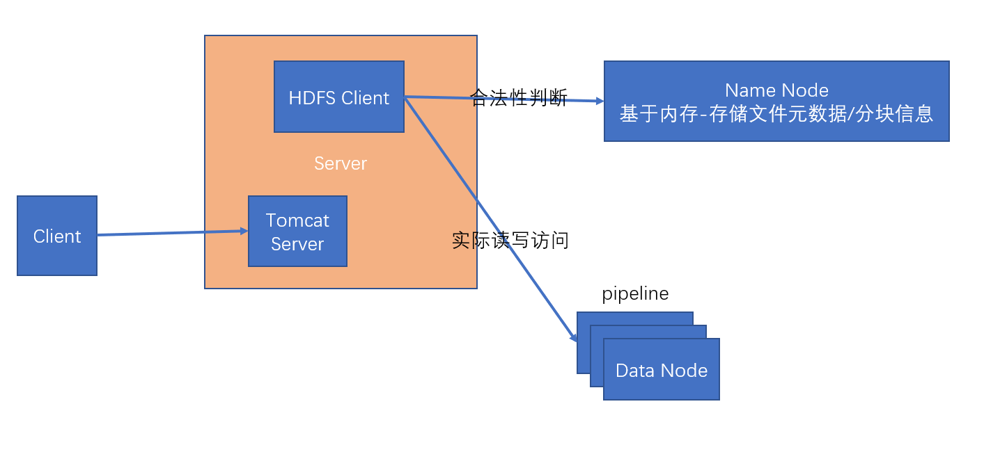
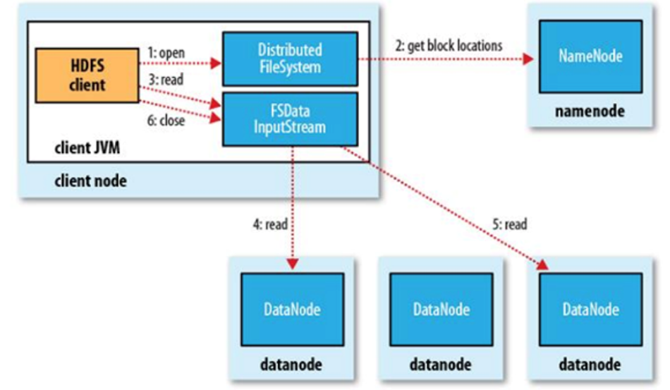
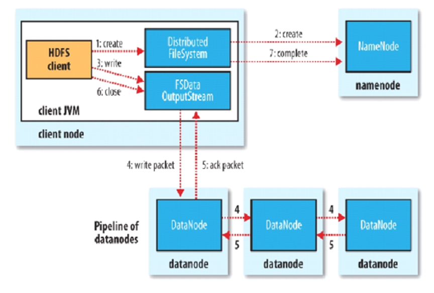

HDFS(Hadoop Distributed File System)
1. HDFS存储模型 --- 文件块
    - 块: 以字节为基本单位，根据硬件I/O速度可动态安排
    - 不同文件可设置不同的块大小，但某文件的块大小一旦
    被确定将不能再被修改
    - 块拥有副本概念，并且所有副本之间并无主从概念；不同
    块副本将会被存储在不同机器上
    - HDFS块是只读的，若支持修改会引发“泛洪”现象
    
2. HDFS角色设计:
    - Name Node: JVM进程，所有Node的统领者，负责记账功能
    - Data Node: JVM进程，实际存储数据的节点
    - Client: 文件系统的客户端，一般安装在服务器上

3. HDFS架构设计
    

4. HDFS Name Node 元数据持久化策略:
    - Edits Log: 记录日志，所有对文件系统操作的命令都会追加
    到日志尾；当时间很长，日志体量会很大，恢复时间长
    - FsImage: 镜像/快照，对某个时间点的数据进行复制，并滚动
    更新时点；在复制时会消耗机器CPU，并且丢失的数据比较多
    - Edits Log + FsImage: HDFS采用的方式，某个时点的FsImage
    加上直到下一个时间点前的Edits Log作为恢复源
    
5. HDFS 副本放置策略:
    - 第一个副本: 放置在客户端安装的那台Data Node上(如果是)；
    否则随机选择一台CPU占用率不高的机器
    - 第二个副本: 放置在与第一个副本放置位置不同机架的机器上
    - 第三个副本: 放置在与第二个副本放置位置同一个机架上
 
6. HDFS读写策略:
    - 读:
    
        - 客户端访问Name Node，判断所读文件是否存在
        - Name Node判断文件存在，并返回所有副本的位置列表
        - 客户端读取副本列表，选取最近的Data Node进行数据读取
        - 由于数据分块，支持随机访问块数据
        - 通过Data Node返回的数据及响应块的校验和，可判断文件
        数据是否正确
    - 写:
    
        - 客户端访问Name Node，判断相应完整文件名是否已存在
        - Name Node记录文件对应的元信息，并为文件块安排相应
        的副本放置策略(是某个文件块？还是整个文件的所有块？)，
        并返回给客户端
        - 客户端通过返回的副本安排位置，组建管道；并以小包packet
        为单位进行数据管道传输
        - 相应副本存储完毕后，对应的Data Node在向Name Node发送
        的心跳信息中夹带确认信息，供Name Node使用

7. Hadoop的安装过程:
    - jdk安装
    - ssh安装与免密配置
        - ssh免密涉及到的非对称加密算法
    - 配置hadoop-env.sh，修改JAVA_HOME
    - 配置core-site，新增网页浏览GUI的URL配置
    - 配置hdfs-site，新增name，data，secondary的存储位置，
    和secondary name node 的网页浏览URL
    - `hdfs namenode -format`初始化hdfs
    - `start-dfs.sh`启动namenode，datanode
    - 使用`hdfs dfs`相关命令操作文件系统