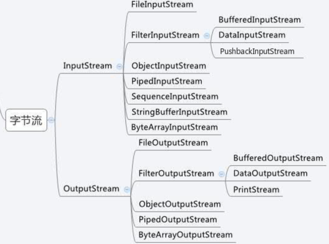

1. 字节流部分图展示:
    
    - FileInputStream / FileOutputStream:
        - 基础文件输入输出流
        - 输入流从文件中读取数据，通过`read`方法；可以读取一个字节，或通过
        字节数组缓冲区一次读多个字节
        - 输出流将数据输出到文件中，通过`write`方法；可以写入一个字节，或
        通过字节数组缓冲区一次写入多个字节
    - ByteArrayInputStream / ByteArrayOutputStream
        - 基础输入输出流，可通过与`FileInput/OutputStream`不同的是，
        数据是从字节数组来的
        - 输入流从字节数组中读取，并将数据放到内部的buffer缓冲区；
        可以通过`read`方法读取相关数据
        - 输出流将数据写入buffer缓冲区，并且可以通过`toByteArray/toString`
        将数据展示出来
    - Buffered/Data/Object:
        - 这个系列的输入输出流，都是在基础流之上，包装一层新流，使原有
        流具备一些新功能，实现本质都是通过缓冲区
        - Buffered:
            - Input: 提供了skip, reset, mark等功能，可以重复读取流等等
            - Output: 内部缓冲区，可以保证不会对每个字节的write都调用一次系统
            调用；本质和`FileOutputStream`的`write(byte[])`差不多
        - Data:
            - Input: 提供了大量的`readBoolean/readDouble`等可以直接读取Java
            基本类型数据的方法
            - Output: 提供了大量`writeBoolean/writeDouble`等可以直接写入Java
            基本类型数据的方法
        - Object:
            - Input: 比起`Data`，还提供了支持序列化的Class的`readObject`和方法
            - Output: 比起`Data`，还提供了支持序列化的Class的`writeObject`和方法