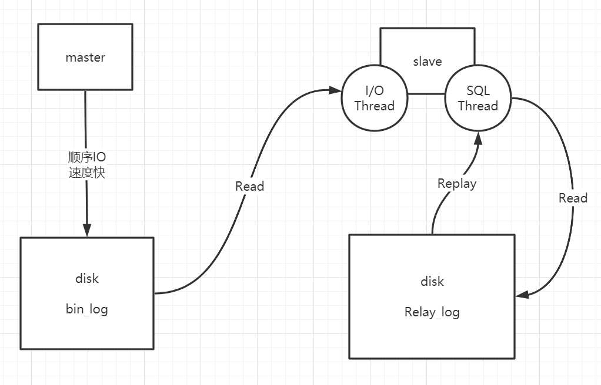

1. MySQL主从复制架构:
    
    - master会将写操作记录到bin_log日志中
    - slave开启`IO Thread`定期轮询master，当发现master的`bin_log`
    发生变化时，会向master请求日志信息
    - 主节点为每一个`slave`启动一个`dump`线程，负责发送二进制事件
    - `slave`接收到日志数据之后，开启`SQL Thread`执行相应命令
    
2. MySQL主从架构的数据同步问题:
    - slave Relay log采用磁盘随机写，磁盘I/O效率低；
    - SQL Thread单线程执行命令，速度慢
    - 在高并发场景下，大量的写操作导致`master`的`bin_log`
    膨胀速度远大于`slave`的处理速度，从而出现数据同步问题
    - 5.7之前的解决方案:
        - 请求分发，采用分库架构
        - 单库读写分离
        - 业务和Mysql之间，增加redis缓存层
        - 优化硬件设备
    - 5.7之后的解决方案:
        - MTS: Multi Thread Slave
            - 原来Slave是单线程处理数据的，在引入MTS之后
                - SQL Thread -> SQL Thread/Coordinator Thread
                - 事务组: 同一事务组的不同事务之间相互不影响
                    - 使用GTID来标记不同事务组(具体实现: `last_commited`, `sequence_number`)
                    - `SQL Thread`接收到日志输出之后，会转交给多个`worker`
                    线程
            - MTS可能有的问题:
                - 在主机负载不大时，每次可能只有一个事务提交
                - MTS比之前多了一步`SQL Thread -> worker`，
                在这时候，会比原来的性能更差
                - 解决:
                    - 自动调整功能？
                    - 问题不大，因为本来主机的负载也不大，这时候
                    同步慢一点也没有关系
            - 更多资料: [MTS](http://www.360doc.com/content/15/0815/14/18924983_491798761.shtml)