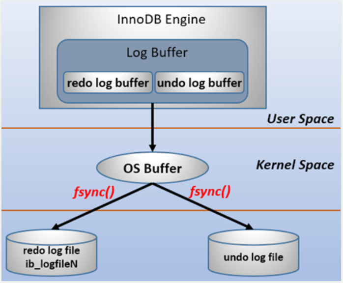
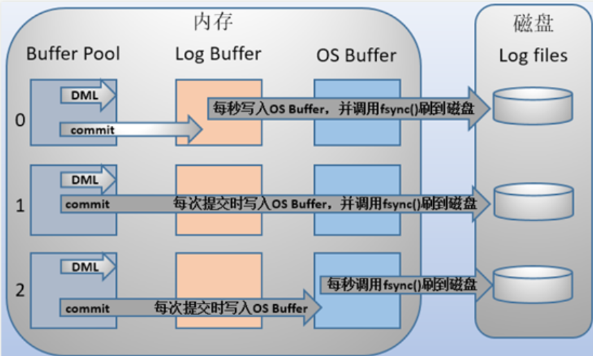

1. InnoDB存储引擎日志:
    - redo_log:
        - 作用:
            - 当需要向数据库写入数据时，每次写入都进行磁盘IO是非常耗时的
            - 一个优化思路是: 缩小每次需要写入的数据量，可以使用日志记录
            一个逻辑上可以恢复出数据的条目，更加轻量化；
            - 写入数据时只需要写进内存之后，就可以马上向客户端返回响应；
            但是日志必须保证可靠
        - 缓冲与磁盘:
            
        - redo_log的一些问题与参数配置:
            - redo_log日志文件本身也可能因为机器down掉而导致数据丢失，
            从而导致数据不一致
                - 参数解决: `innodb_flush_log_at_trx_commit`
                    
                    - 0: 事务提交时，不会立马将log buffer中的日志写入os buffer，
                    每隔一秒提交一次，os buffer会马上将日志数据刷到磁盘
                    - 1: 默认配置；事务每次提交都会将`log buffer`中的日志写入
                    `os buffer`并调用`fsync()`刷到磁盘
                    - 2: 事务提交时，马上将`log buffer`中的日志写入`os buffer`，
                    每个一秒，`os buffer`刷一次磁盘
                    - 由于0和2都是掉电易失的，会损失1s的数据；因此不推荐使用
                    - 更好的做法时，选用1，并在commit时多提交一些数据
                - 参数`innodb_flush_log_at_timeout`: 每隔`timeout`秒，刷一次日志
        - log block, log group
        - redo log日志刷盘规则
        - LSN
        - 更多条目的详细信息查看: [detail](https://www.cnblogs.com/f-ck-need-u/archive/2018/05/08/9010872.html)
    - undo_log:
        - 保证事务原子性；当事务需要回滚时，借助`undo_log`回滚
        - 可以大致用以下流程来认识`undo_log`:
            - `delete`一条记录时，会在`undo_log`中增加一条`insert`记录
            - `insert`一条记录时，会在`undo_log`中增加一条`delete`记录
            - `update`一条记录时，会在`undo_log`中增加一条相反的`update`记录
   

