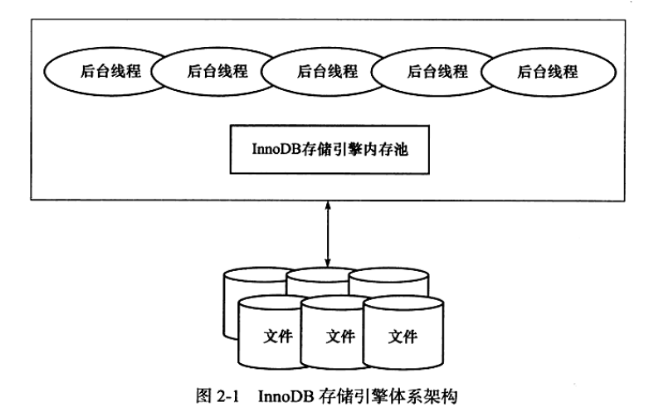
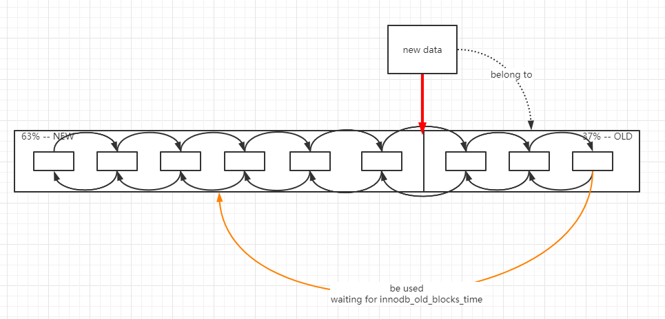
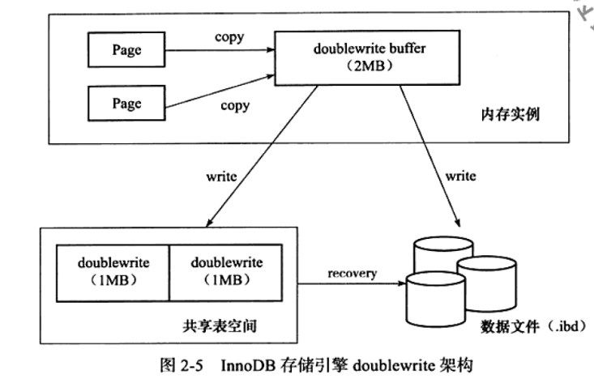

1. 数据库基本概念:
    - 数据库本身在磁盘中的表现是一堆文件，如`frm, ibd, myd`等文件；
    - 存储引擎正是组织这些文件的本体
    - MySQL服务层提供统一的接口，不同的存储引擎利用这些接口实现自己的特性
    
2. Innodb存储引擎的架构:
    
    - 后台线程:
        - master thread
            - MySQL核心线程，主要包括四个循环: loop，background，flush，suspend
            - 主要处理四件事:
            
                i. `redo log`刷盘
                
                ii. 刷脏页(checkpoint)
                
                iii. 合并缓冲(insert buffer)
                
                iv. purge线程出现前，进行undo相关的purge
                
        - I/O thread: 四个任务，分别是: write、read、insert buffer、log IO thread
        - purge thread: 负责将不再被事务引用的undo log清理，使undo页可以被再利用
        - page cleaner thread: 刷脏页线程
    - InnoDB存储引擎内存池
        - 缓冲池: 包含数据页、索引页两个大头，以及插入缓冲、锁信息、自适应哈希索引等信息
            
            i. 缓冲池诞生原因:
                
                每次对数据库的DML操作，都需要对相应页进行修正操作；如果每次对页进行的修改都需要
                马上写入磁盘，则会极大影响MySQL性能
            ii. InnoDB缓冲池采用淘汰算法: LRU细节
                
                
                1. 在全表扫描这样的操作时，可能需要访问全表的页；而其中的大部分页只在第一次被加载的
                时候需要，若采用朴素LRU算法，可能会将大量常用页刷出缓冲池
                2. 有一部分的数据，会被预加载到缓冲池；对于这部分数据，可能只在最开始的时候迅速访问
                几次之后，便再也不会访问；因此设置`innodb_olb_blocks_time`，来控制页`made young`
                
        - 重做日志缓冲: redo log buffer，一般会在以下三个时刻，将redo log buffer中的数据刷盘
            - Master thread 每秒一刷
            - 事务提交时
            - 重做日志缓冲剩余空间小于1/2时
            
        - 额外缓冲池: 
        
3. Innodb缓冲池刷脏技术: Checkpoint
    - checkpoint分类:
        i. sharp checkpoint: 在数据库实例关闭时，需要对脏页进行刷脏操作
        
        ii. fuzzy checkpoint: 数据库实例运行过程的刷脏策略
            
            1. Master thread 的刷脏
            2. 缓冲池需要淘汰页时，若被淘汰页是脏页，需要刷脏
            3. `redo log`中`last lsn`快追上`checkpoint lsn`时，需要刷脏；
            默认值需要 last_lsn - checkpoint_lsn < 75% * redo_log_size
            4. 脏页太多时，需要刷脏
            
4. InnoDB关键特性:
    - insert buffer/change buffer
    
        i. insert buffer诞生: 每次对页数据的插入，都需要马上将磁盘中的该页加载到
        数据库缓冲池，这个过程在插入量很大时，非常消耗性能；因此`insert buffer`
        可以通过对插入这个过程批量化，以减少磁盘IO从而提高性能
        
        ii. insert buffer过程:
            
            1. 在插入数据时，判断要被插入数据的页，是否存在于缓冲池；若存在，则直接
            插入数据即可；若不存在，继续进行下一步
            2. 在MySQL共享表空间中，有一颗专门用来存储 insert buffer 信息的 B+树；
            将要被插入的数据，放入insert buffer B+树中
            3. 在某一页因为某种原因被加载到缓冲池之后，会首先通过该页对应的 insert_buffer_bitmap
            查询该页是否有记录存在于 insert_buffer_B+树中，若存在则会在此时进行插入操作
            
        iii. insert buffer使用限制: 只能用于**非唯一辅助索引**上
        
        iv. insert_buffer_B+树结构:
            
            1. 非叶节点接口:  | space | marker | page_offset |
            2. 叶节点:  | 非叶节点数据 | 插入辅助索引的数据 |
            3. insert_buffer_bitmap作用:
                保证 merge 操作一定能够成功；因为每次插入数据都把数据丢到 insert_buffer_B+树
                中，因此可能产生某一页要被插入的数据过多从而因为空间不够而merge失败的情况；这时
                需要insert_buffer_bitmap实时检测，当发现某页剩余空间少于 1/32 时，马上进行
                缓冲合并
            
    - double write: 保证刷脏页的可靠性
        
        
        i. 双写缓冲大小为`2MB`, 分两次写入，每次最大写入磁盘64页
        
    - 自适应哈希索引(AHI)
        
        i. 完全由InnoDB自己控制的，基于B+树索引之上的索引；目标是对那些访问模式固定的页
        进行哈希保存，从而能够降低每次访问页的磁盘IO
        
    - AIO
    - 刷新邻接页，以Extent为单位进行脏页刷新
    