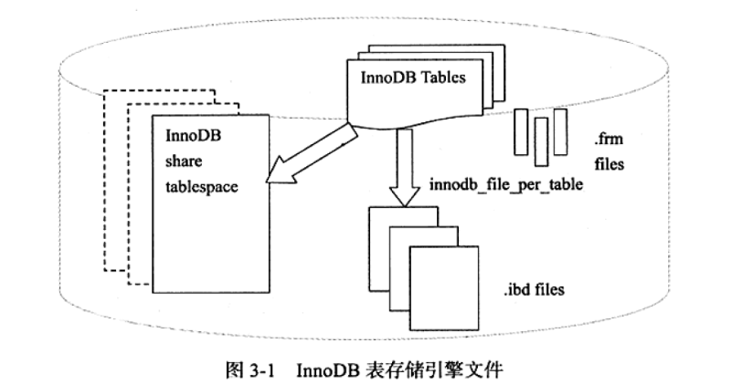

1. 文件类型概览:
    - 参数文件: my.cnf
    - 日志文件
    
        i. 错误日志，host.err
        
        ii. 慢查询日志: 基于时间/基于索引/基于IO次数
        
        iii. 查询日志
        
        iv. 二进制日志
        
    - socket文件
    - pid文件
    - MySQL表结构文件
    
        i. frm文件: 存储表结构定义，以及视图定义
        
    - 存储引擎文件
    
2. 二进制日志
    - 逻辑日志，记录了DML操作相应的SQL语句或行变换语句
    - 二进制日志相关参数介绍：
    
        i. `binlog_cache_size`，`sync_binlog`和`innodb_support_xa`
        
            1. bin_log的刷盘操作，都是通过缓冲刷盘来实现的
            2. 在一个事务执行的过程中，产生的二进制日志都会记录到缓存中；
            事务提交时，同一个事务的所有二进制日志会被一起写到磁盘中
            3. binlog_cache基于会话，即一个事务对应了一个cache
            4. sync_binlog 参数表示每写缓冲多少次就同步到磁盘；为1时，表示同步写磁盘
            5. 通过 innodb_support_xa 参数来控制 bin_log与redo_log的一致性；
            通过MySQL内部分布式事务，两阶段提交来保证
        ii. `binlog_format`:
        
            1. statement: bin_log存储原生DML语句
            2. row: 会将DML对应的SQL语句转化为针对行的SQL语句；因此在此格式下，
            bin_log也不是幂等的
            3. mixed: 两种格式混用，在某些特殊情况下使用row格式
            
3. InnoDB表存储引擎文件概览:
    