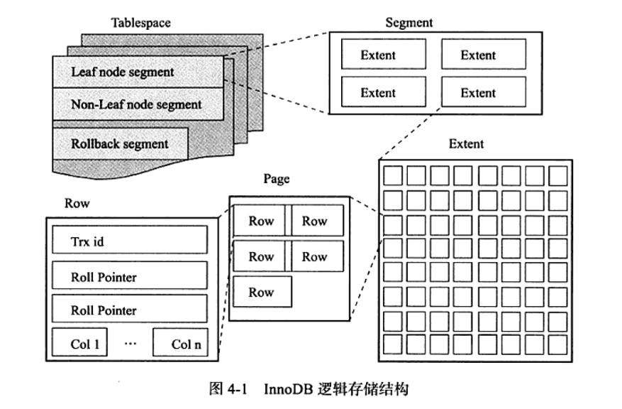

1. 表的两种组织方式:
    - 索引组织表: 将数据放在聚集索引中，即使用主键来组织表；这是InnoDB采用的方式
    - 堆表: 将数据单独放在一个数据文件中，这是MyISAM采用的方式
    
2. InnoDB逻辑存储结构
    
    i. 表空间(table space):
    
        1. 公共表空间: 所有表共有空间，存储像 insert_buffer_B+_tree 这样的结构
        2. 私有表空间: 存储数据以及索引页
        
    ii. 段(segment): 由存储引擎完成管理
        
        1. leaf node segment: 数据段
        2. Non-Leaf node segment: 索引非叶子节点对应的段
        3. Rollback segment: 存储undo log相应信息的段
        
    iii. 区(extent): 
    
        1. 固定大小，1MB，所以在InnoDB默认页大小为16KB的情况下，
        每个Extent能够存储64页
        2. 新建表的时候，表的初始大小是96KB；而根据InnoDB逻辑存储
        结构来看，至少也应该有一段；即表大小至少也应该是1MB，为什么
        会出现这样的现象呢？ 
            因为在每个段开始时，先用32个页大小的碎片页来存放数据，
            使用完这些页之后才是64个连续页的申请；这样做，对于一些
            表的存储可以在开始时申请较少空间，而不是在一开始就申请
            一整块可能今后都不会用到的大空间
        
    iv. 页: 
    
        1. 数据页结构:
            File Header: 
                checksum: 页的checksum值
                page_offset: 页在表空间中的偏移，相当于index
                prev, next: 前一页与后一页指针
                page_lsn: 该页对应的lsn(redo log相关)
            Page Header:
                slots: 与page directory有关，表示对应的记录组组数
                page_free: 可重用空间列表首指针
                page_garbage: 被删除记录的字节数，即deleted_flag为1的记录数
                page_last_insert, page_direction, page_n_direction: 与页分裂相关的参数
            infimum/supremum: 最小记录与最大记录
            Row data: 实际行记录存储
            Free space: 空闲空间，可分配给行记录存储
            Page directory: 页内记录搜索算法核心
                - 页内所有的记录，会被分为若干组，组数与page header中的slots相同
                - 各组以该组中最后一条行记录的next_record作为标志；
                - 每组对应的slot在Page directory中是递增的
                - 共有三种组类型:
                    最小组: 只有infimum一条行记录
                    最大组: [1, 8]条记录
                    普通组: [4, 8]条记录
                - 在查找某条记录时，根据主键使用二分查找法，快速找到所需行记录所在组，
                    再遍历组中记录，找到最终记录
                - 在插入某条行记录时，根据主键使用二分查找法，找到比此主键大的最小组，
                将记录插到此组中
                - 当组记录数超过8时，会将组分裂成长度为 4 + 5 的两个组
            File tailer: 存储checksum + page_lsn
    
    v. 行: 目前版本的InnoDB，分为两个大类型，分别是: Antelope和Barracuda
    
        1. Compact:
            | 变长字段长度列表 | Null vector | 记录头 | 数据 |
            变长字段长度列表: 
                变长字段: varchar, 
                        大于768字节的char, 
                        使用uft8这样字符集的char,
                每个长度可能是1个字节，也可能是2个字节；具体通过以下标准判断
                    1byte: maxLen <= 255 && realLen <= 127
                    2byte: maxLen > 255 || realLen > 127
                    对于长度大于768bytes的字段，如果采用off-page的话，会在数据
                    部分对应的列数据后追加20bytes，表示off-page的指针
            Null vector:
                占用字节数取决于值可以为Null的列数，大小为 ceil(column_num / 8) bytes
                每一位表示，该行中某列的值是否为Null
            记录头: 
                大小: 5 bytes
                内容: 
                    deleted_flag: 该行是否被删除的标记
                    n_owned: 与 page directory 相关，表示对应行记录组的行记录数
                    next_record: 表示当前逻辑顺序下一行的位置指针
                
        2. Redundant:
            | record directory | 记录头 | 数据 |
            record directory: 指向行数据中，每一列指针的列表
            记录头: 6 bytes, 在Compact基础上多了1 byte的其它字段信息
        3. Compact与Redundant行记录比较:
            - Redundant一般说是用来兼容老版本InnoDB的
            - Compact一般比起Redundant会有20%的空间节省；
            而越小的行记录意味着每一页能够存储更多的行，变向
            降低了磁盘IO
            - Compact比起Redundant的空间节省:
                长度列表只存储变长字段的
                通过Null vector来记录Null值；而Redundant对于Char类型的列，仍会在数据中进行填充
        4. Antelope类型中存在的行溢出(off-page)现象:
            - InnoDB在检测到B+树每页只能存储一个行记录的时候，会按照列数据
            长度，从大到小依次off-page，从而使得一页可以存储多行；不然B+树
            退化成链表了，B+树就失去了意义
            - 在行中，会存储off-page字段的768字节作为prefix，再加上20bytes
            的指针，指向off-page
        5. Antelope存在的问题，以及Barracuda的诞生:
            - Antelope对于长数据，依然会存储prefix，在字段
            非常多的情况下(默认最长是1024个字段)，行记录的prefix
            就会占用非常多的空间
            - Barracuda中的Compressed和Dynamic对这里进行了优化，
            对于长字段，在原行记录中页不存储prefix
       
3. 约束:
    - 约束概念: 逻辑概念，可以理解作是表的性质
    - 常见约束类型:
        
        i. 一个表被规定必须有主键 -> 主键约束
        
        ii. 表中属性，各列都有字段类型，是否为Null等约束
       
        iii. 表与表之间的关联，也是一种约束 -> 外键约束
       
    - 约束实现方式:
        
        i. MySQL自带约束: 如主键约束，外键约束等
        
        ii. 使用触发器，实现自定义约束
        
4. 视图:
    - 视图概念:
        一张虚拟表，不会在磁盘上存储任何表中信息；
        所有表中的数据，都是从实际存在的表中找出来的；
        MySQL视图都是基于SQL语句的虚表
    - 视图分类:
        
        i. 普通视图
        
        ii. 物化视图: 会作磁盘存储的视图；MySQL可以使用约束
        和触发器来模仿实现物化视图
        
5. 分区表:
    - 分区表概念:
        将原本存储于一个ibd文件中的数据，按照一定规则分解为多个文件；
        从而实现将不同范围的数据剥离存储
    - 分区类型:
        
        按整数值进行分区:
        
        i. RANGE分区: 基于连续区间划分分区
        
        ii. LIST分区: 基于离散值集合划分分区
        
        iii. HASH分区: 根据hash值分区
        
        iv. KEY分区: 使用MySQL提供哈希函数hash之后，根据hash值分区
        
        按列进行分区:
        
        v. COLUMNS分区
       
    - 子分区: 分区中的分区；一般父分区为RANGE/LIST类型，子分区为HASH/KEY类型
    - 分区与性能:
    
        i. 分区了就能提高性能？
            考虑这样一种情况，某表经常通过辅助索引来进行查找操作；
            而分区是通过主键值进行分区的，这样即使分了区，实际查找
            的数据也可能分布在不同区中；这样每次查找数据都需要去多个
            不同区查找，所需要的磁盘IO数是原来的几倍