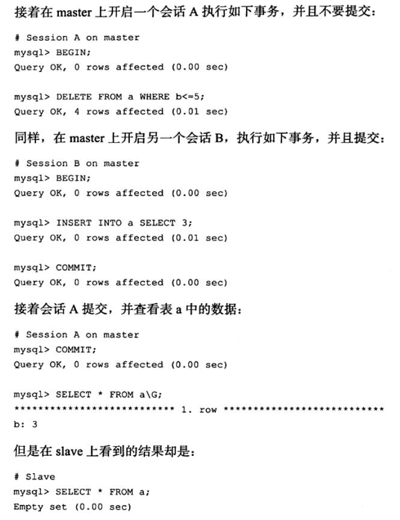

1. InnoDB锁分类:
    - 共享锁(S锁)与排他锁(X锁): InnoDB行锁
    - 意向锁: 为了解决表锁和行锁的共存问题而诞生
    
        i. 在一个表中某一行被上了行锁时，不能再|给这张表表锁
        
        ii. 如何判断一张表是否被上了行锁？
            
            - 遍历所有表行
            - 标记被上了行锁的行(是否可重入？多个事务加了S锁?)
            以上两种方式，一种效率很低，一种实现起来复杂
            - 使用意向锁: 每个事务要获取某行的行锁，首先要获取整张表的意向锁
            
    - 自增长与锁:
        
        i. 表主键实现自增长需要:
            
            1. 表空间内需要一个自增长计数器
            2. 多个事务进行插入操作时，需要对计数器进行锁操作
           
        ii. 计数器锁操作使用的特殊锁类型
        
            1. auto_inc_lock: 每次对计数器进行自增长操作时，加锁；操作完马上释放锁；
                            此锁相对较重，因为是对Insert语句加锁的
            2. mutex互斥量: 比起`auto_inc_lock`更轻量级的锁
            3. 插入类型:
                simple_inserts: 插入前可确定插入行数的语句
                bulk_inserts: 插入前不能确定行数的语句
            4. 自增长加锁机制，可以通过参数`innodb_autoinc_lock_mode`来控制
                0: 统一采用auto_inc_lock
                1: simple_inserts采用mutex，bulk_inserts采用mutex
                2: 统一采用mutex
                第二种方式可能存在的问题:
                    由于bulk_inserts无法确定行数，故即便统一采用mutex的方式，
                    也是在进行实际Insert操作时，才会对一行采用mutex获取到当前
                    计数器值；这个过程在多事务并发插入时，同一条Insert语句批量
                    插入的各行，主键值可能不是连续的；这在bin_log使用statement
                    格式进行同步时，会出现主从不一致的问题
    - 外键与锁:
    
        i. MySQL对加上了外键约束的字段，默认会添加索引;
            若不添加索引，则有很大概率会造成死锁(主表删除字段检查与副表添加字段检查冲突)
                    
2. MySQL读: 默认的读取方式是一致性非锁定读
    - 一致性非锁定读: 可在其它事务对某行上了X锁的情况下，读取改行；
    原理采用了MVCC，undo log的应用
    - 一致性锁定读: 一般的读取方式
    
3. 锁算法:
    - 记录锁(record lock)
    - 间隙锁(gap lock)
    - Next-Key lock: 
        解决了`Phatom Problem`，使MySQL在`REPETABLE READ`隔离级别下，
        就解决了幻读问题；就是区间锁+边界(记录), 在读的时候若加上S锁，则会
        锁整个区间，其它事务就不能在加锁的范围中进行插入操作了，自然就解决了
        幻读问题
    - 在MySQL`READ COMMITED`隔离级别下，如果bin_log使用`STATEMENT`格式，
    主从的数据一致性可能会出现问题；因为`READ COMMITED`不采用`Next-Key lock`，
    具体可能出现下图问题:
        
        
4. 锁问题:
    - 脏读: 当前事务读到其它事务未提交的数据
    - 不可重复读: 当前事务读到其它事务已提交的，经过修改的数据
    - 丢失更新: 类似`i ++`问题，先从数据库把某个数据取出来并放到
    内存，之后进行修改写回的过程，可能会出现两个事务更新数据覆盖的问题
    
5. 死锁:
    - InnoDB使用`wait-for-graph`主动检测死锁
    
6. 锁升级:
    - InnoDB不支持锁升级，对于页中行锁，使用位图的方式来实现