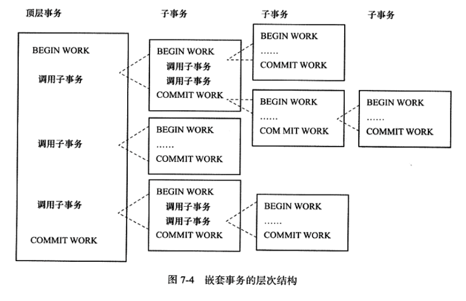
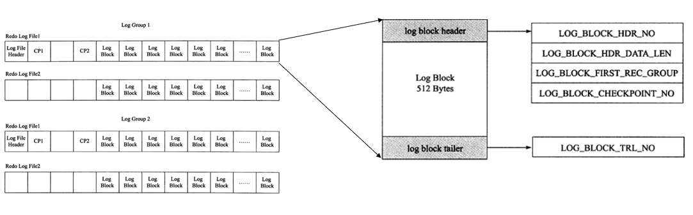
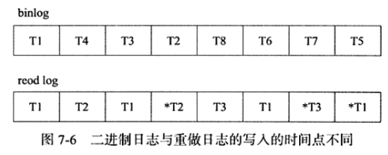
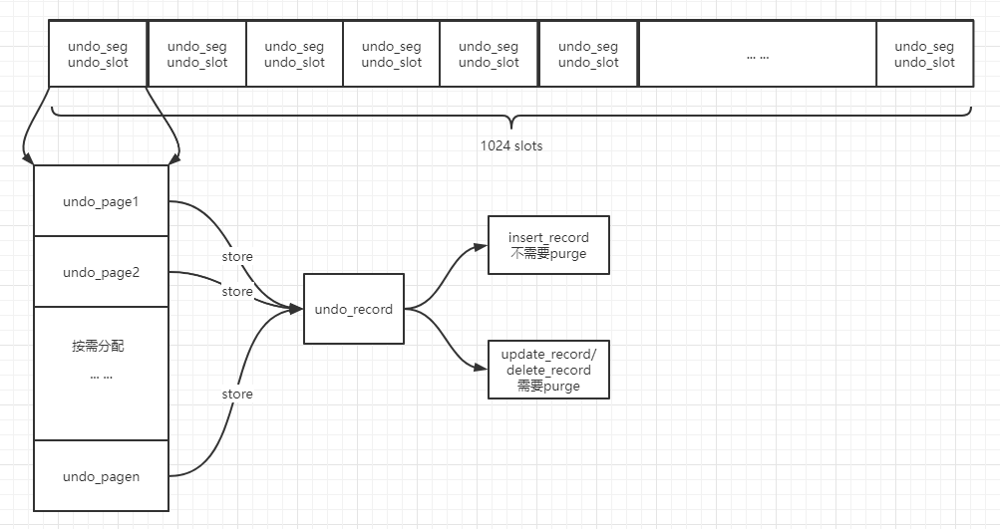
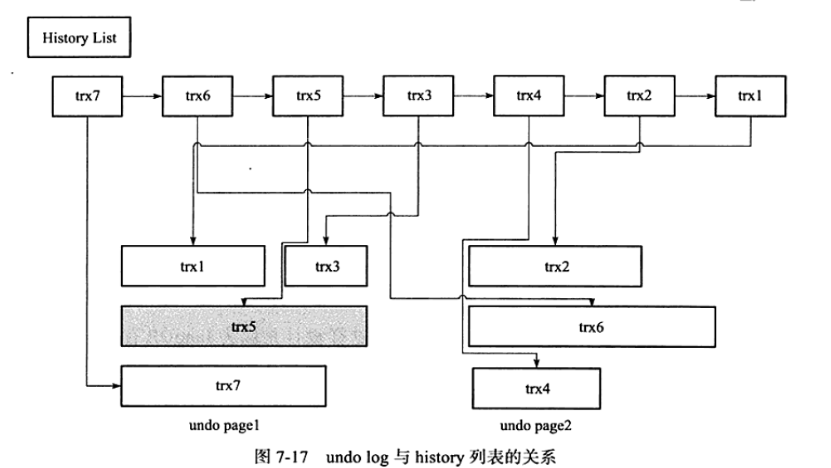
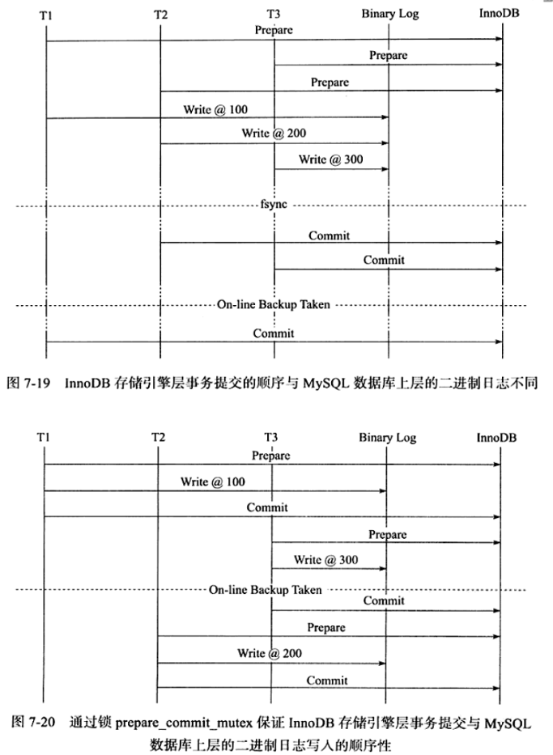
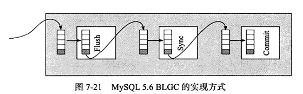

1. 事务概念和分类:
    - 事务概念:
    
        i. 访问并更新数据库中各种数据项的一个程序执行单元
        
        ii. 四个基本特性: A(Atomic)、C(Consistency)、I(Isolation)、D(Durability)
        
    - 事务分类:
    
        i. 扁平事务(Flat Transactions)
        
        ii. 带有保存点的扁平事务(Flat Transaction with Savepoints)
        
        iii. 链事务(Chained Transactions): 当前事务提交后默认开启新事务
        
        iv. 嵌套事务(Nested Transactions): 
            
        
        v. 分布式事务(Distributed Transactions)：
        
            1. 普通分布式事务(设计多个节点之间的事务)
            2. 内部XA事务
           
2. 事务的实现: 日志
    - 重做日志(redo log):
        
        i. 概念:
            物理日志，本质记录的是每页记录的修改；为了解决缓冲区刷脏
            可能存在的数据不一致问题而诞生
        
        ii. redo log存储结构:
            
            
            1. log group: InnoDB的重做日志组，每组中有若干个容量相同的文件，
            共同组成整个log group；并且每个group中的各个文件在逻辑上都是连续
            并且环形的
            2. log block: 
                - redo log组成基本单位，所有的刷盘操作都以block为单位
                - log block header: 包含
                    当前块位置信息(数组索引)
                    该块存储的数据大小
                    该块第一个日志所在偏移量(从此块中开始的事务)
                    该块对应的checkpoint lsn
                - group中每个块的前四个块为默认保留块
                - log block body日志存储格式:
                    | redo_log_type | space | page_no | redo_log_body |
                    redo_log_type: 像增，删，改都对应了不同的日志类型
                    space: 对应表的spceId
                    page_no: 对应表空间的页偏移号
        
        iii. redo log 刷盘策略:
            
            1. Force Log At Commit: 默认提交时将重做日志缓冲刷到磁盘
            2. 参数`innodb_flush_log_at_trx`
                0: 提交事务不触发刷盘
                1: 每次事务提交都触发刷盘
                2: 每次事务提交，将重做日志缓冲中信息刷到操作系统缓冲
                
        iv. `redo_log`与`bin_log`的比较
        
            1. redo_log是物理日志，bin_log是逻辑日志
                - 物理日志: 对页中某个具体位置，记录其修改
                - 逻辑日志: 只是抽象的Insert/Update等语句，
                执行前未知其做出的具体修改
            2. redo_log是幂等的(执行多次之后结果一样)，因为是物理日志
               undo_log是非幂等的，因为是逻辑日志
            3. redo_log是InnoDB存储引擎层实现的日志，而bin_log是MySQL服务层实现的日志
            4. redo_log在每次执行语句时，都会有新的redo_log记录写入重做日志缓冲的log block中
               undo_log对每个事务单独维护一个cache，所以针对单事务的所有语句信息都是连续的
               因此，redo_log与undo_log页可能存在以下的差异
           
       
        v. LSN与checkpoint:
            
            五个LSN重要概念:
            1. 页中LSN: 在每次页被进行增删改操作时，会写入页头中
            2. redo_log_buffer_lsn: redo_log最新的LSN
            3. 磁盘redo_log文件的checkpoint: 指当前被刷完的最新脏页对应的LSN
            4. 磁盘redo_log文件的last_lsn: 指当前redo_log刷新到的磁盘的最新位置
        具体的操作流程，参考: [LSN详细解析](https://www.cnblogs.com/f-ck-need-u/archive/2018/05/08/9010872.html#auto_id_8) 
            
    - undo log:
        
        i. undo_log实现的功能:
            
            1. 事务回滚
            2. MVCC: 可以利用undo_log来支持一致性非锁定读 
          
        ii. undo_log存储结构:
            
            
            1. 整个段是一个rollback_segment;可存储在共享表空间，最大可设置128个回滚段；
            其中32个临时回滚段和96个物理回滚段，对于临时回滚段不进行持久化
            2. undo_slot: 每个undo_slot只能存储一种类型的undo_record，并且每个undo_slot
            只能给一个事务同时使用；这意味着一个既进行插入又进行了更新的事务，需要两个undo_slot；
            并且默认情况下，如果只有一个回滚段，最多只能支持1024个在线事务
            3. undo_slot内也是由页组成的，按需分配新页
          
        iii. purge与history_list
        
            1. purge的作用: 删除某页的某条记录，并不会真的删除，只是在记录头中修改了deleted_mask位；
            真正删除是由purge线程做的，并且purge线程同时会腾出一些新页给undo_slot用
            2. history_list收集流程:
                - 链表存放: undo_slot
                - 虽然每一个undo_slot只能同时给一个事务用，但在某个事务结束之后，
                如果该undo_slot满足一定条件的话，可以重复利用；因此每个undo_slot
                中可能存有多个事务的undo_log信息
            
        
        
3. 二阶段提交与组提交:
    - 二阶段提交(内部XA事务): 为了保证事务提交后，redo_log与bin_log的数据一致性
        
        i. prepare阶段: redo_log刷盘，并且会记录属于当前事务的唯一ID，
        将其写到bin_log中
        
        ii. bin_log刷盘，如果此步刷盘成功，则事务提交成功；否则都会进行回滚；
        
        iii. COMMIT阶段: MySQL服务层向存储引擎发出COMMIT信号; 即便此步失败
        了，事务也不会回滚；因为在重启数据库时，会检测到bin_log最新的事务唯一ID
        与redo_log的相同
    - 组提交:
        
        i. 存储引擎层组提交:
            
            1. 日志写入重做日志缓冲与fsync刷盘的过程可以同步进行
            2. fsync刷盘前，可以等待多个事务日志写入，从而批量fsync
           
        ii. MySQL数据层与存储引擎层的同步问题:
            
            
            1. 在一个事务的二阶段提交过程，同一个事务的三个阶段必须是严格连续的；
            否则会出现像上图第二种情况的问题(在Online-backup-taken种宕机)
            2. 需要prepare_commit_mutex锁，但是这样会影响存储引擎层的组提交
        
        iii. BLGC(Binary Log Group Commit):
            
            
            1. Flush阶段: 负责redo_logPrepare以及将bin_log刷到内存
            2. Sync阶段: 可设置等待时间；时间到了会将所有内存中的bin_log一起
            成组刷到磁盘；这就是BLGC的过程
            3. 成组调用队列中的事务COMMIT，完成整个提交过程
          
4. 分布式事务概念:
    - 资源管理器: 提供访问事务资源的方法，通常一个数据库就是一个资源管理器
    - 事务管理器: 协调参与全局事务中的各个事务，需要和参与全局事务的所有资源
    管理器进行通信
    - 应用程序