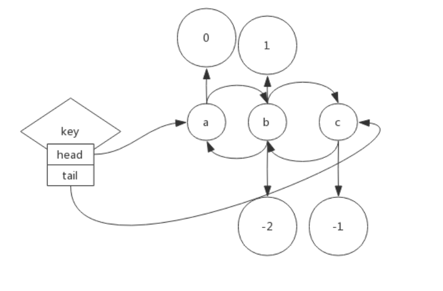

1. Redis-list:
    - 底层采用双向链表实现，并且包含正负索引
        
    - 拥有阻塞操作(B-命令)
    - LPOS: 元素匹配，可指定第几个，以及匹配多少个；返回索引
    
2. Redis-hash:
    - 底层实现是`HashMap`，使用`h-命令`
   
3. Redis-set:
    - 底层实现是`HashSet`，使用`s-命令`
    - scard获取集合元素个数
    - 支持集合运算操作:
        - sinter、sinterstore:
            - sinter直接打印出多个集合运算之后的结果
            - sinterstore会将集合运算结果存储到新的`key`中，
            这样可以在`redis`服务器对新的`key`进行操作；
            而不需要在需要对结果 做处理的基础上，把整个结果通过网络传输
    - 随机事件:
        - srandmember: count可取正负
            - 正: 取出来`|count|`个元素是不重复的
            - 负: 取出来`|count|`个元素可能重复
        - spop: 随机从`set`中取出一个元素
    - scan操作:
        - 避免`smembers`的一种方式
        - 每次`sscan`操作可以控制取出的元素`count`，`redis`
        会帮我们切割整个set，并且返回一个`数字 + subset`
            - 数字表示下一次应该`sscan`的`subset`
            - 每一次返回的`subset`都不会跟前面的重复，
            只要使用返回的数字去`scan`
    
4. Redis-sorted_set:
    - 有序集合，概念上相当于Java的`TreeSet`；使用`Z-命令`
    - 底层使用跳表实现
    - 三个概念:
        - 存储的元素
        - 每个存储元素对应的score
        - 存储元素的逻辑顺序，用索引表示
    - 一些命令:
        - 命令参数规定:
            - min/max: 代表score
            - start/end: 代表索引
        - zrange/zrevrange: 按照索引列出范围内元素
        - zrangebyscore/zrevrangebyscore: 按照分数大小列出范围内元素
        - zrangebylex/zrevrangebylex: 当所有元素的分数相同时，可通过该
        命令返回指定字典序范围内的元素
        - zrank/zrevrank: 确定集合中某个元素的大小排序/注意传入的
        元素必须在集合中存在，才会返回有意义的值
    - 可以使用一些命令对元素的score进行数值运算