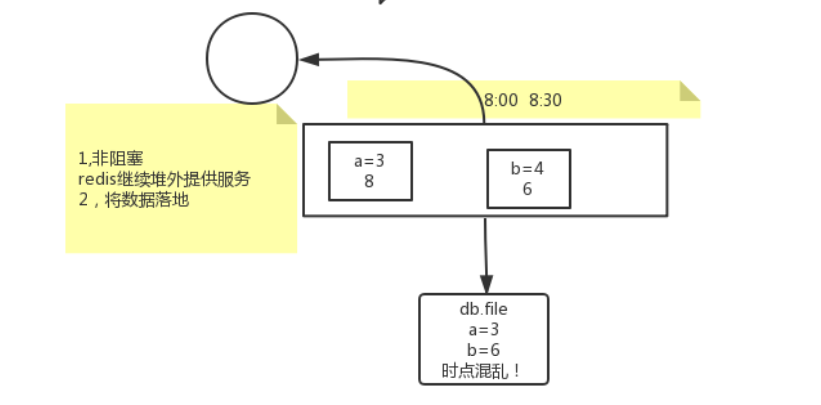
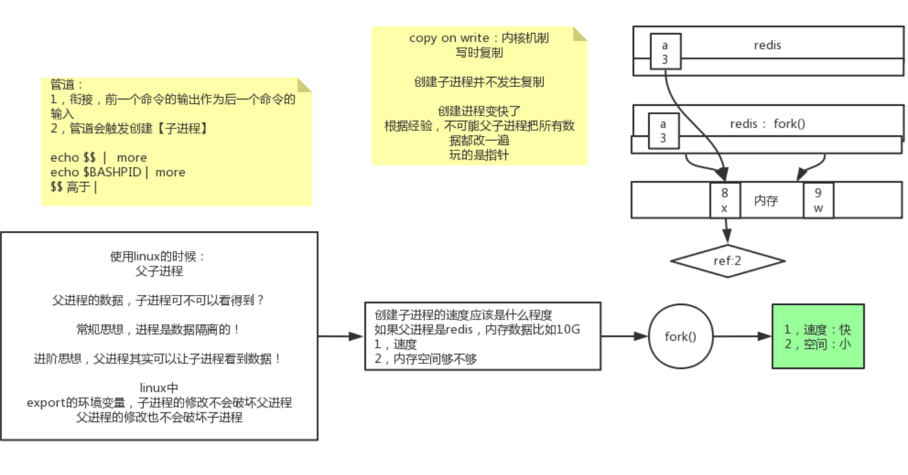
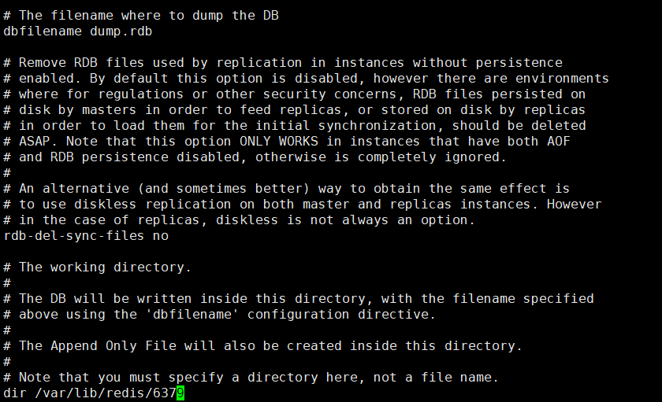

1. 前置知识: 
    - 存储层一般采用以下两种方式保证数据的一致性:
        - 快照/副本
        - 日志(Mysql binlog/Redis AOF ...)
    
2. RDB(快照/副本):
    - Redis Database
    - 几个需要注意的地方:
        - 时点性:
            - 假设在8:00-8:30之间进行副本快照保存，有以下两种方式:
                - 阻塞式: 在copy时，停掉所有服务；意味着在8:00-8:30之间
                redis将不再提供服务
                - 并发式: 在copy时，服务仍旧执行，并且copy进程也会执行
                    - 问题:
                        
                        - 8:10分修改某个条目，被写入了copy进程中；但是
                        先前写入的条目可能在这个时候也被修改，从而导致数据
                        的不一致
                    - 解决:
                        
                        - 参考Linux中父子进程之间共享数据的设置
                        - 在copy时，从原有redis进程`fork`出一个新进程，在新进程中进行数据
                        拷贝；而父进程所做的任何写操作，都不会被子进程感知
        - redis中关于RDB的配置与命令:
            - 命令:
                - save: 阻塞式的快照
                - bgsave: 非阻塞式，使用了Linux的`fork`
            - 配置文件中的配置项:
                - save <seconds> <changes>: 在<seconds>秒之后，如果进行了<changes>次写操作的话，
                会出发RDB快照存储
                - 默认配置:
                    ###
                        save 900 1
                        save 300 10
                        save 60 10000
            - dump出来的rdb文件存储位置: `/var/lib/redis/6379`，
            可通过`dir`配置指定
                
        - RDB的缺点:
            - 不支持拉链，所有文件都会往`dump.rdb`中写；需要手动编写
            脚本让其滚动
            - 丢失数据多；两个RDB时点之间的数据会丢失
        - RDB的优点:
            - 类似Java中的序列化，恢复速度相对较快
            
3. AOF(Append on file):
    - 基本思想:
        - 将所有写操作都写入文件，在需要恢复数据时，
        只需要把文件中所有的命令执行一遍 
    - 缺点:
        - 文件大小会逐渐累积，并且可能有大量无效命令需要执行；
        Redis对这种情况做出了以下处理:
            - 4.0之前: 提供`rewrite`操作，即可以对文件中的命令
            进行重写操作
                ###
                    set k1 a         
                    set k1 b  ->  set k1 c
                    set k1 c
            - 4.0之后:
                - 依然支持重写操作，但在重写之后，会将老的数据做一次
                RDB快照，将这部分数据对应的指令删除；之后将RDB快照
                和新的指令一起存储在`aof`文件中
                - 即4.0之后的`AOF`实际上是`RDB + AOF`
                - 通过`aof-use-rdb-preamble`配置项指定: `RDB + AOF`，
                指定为`no`时，只有重写不会有`RDB`
        - 每个写操作都需要写入到磁盘文件中，大量的磁盘IO影响Redis的效率
            - Redis提供的一些配置项，缓和此问题:
                - `appendonly`: 开关配置，是否打开AOF；默认是no，因为要
                保证redis高性能
                - `appendfsync`: 写操作写入磁盘的频率
                    - `always`: 每有一个写操作，都会把此操作写入磁盘中的`aof`
                    - `everysecond`: 每秒集中写一次
                    - `no`: 等Linux缓冲区满了之后，才会往磁盘写
                - `auto-aof-rewrite-percentage`, `auto-aof-rewrite-min-size`:
                    - 保证日志文件不会太大
                    - 第一个: 触发aof自动重写的百分比
                    - 第二个: 触发aof自动重写的内存大小
                    - 百分比解释:
                        - redis会自动记录上一次重写之后的文件大小: base_size
                        - 当前的文件大小为current_size
                        - 当`current_size > (current_size - base_size) / base_size`时,
                        会触发重写