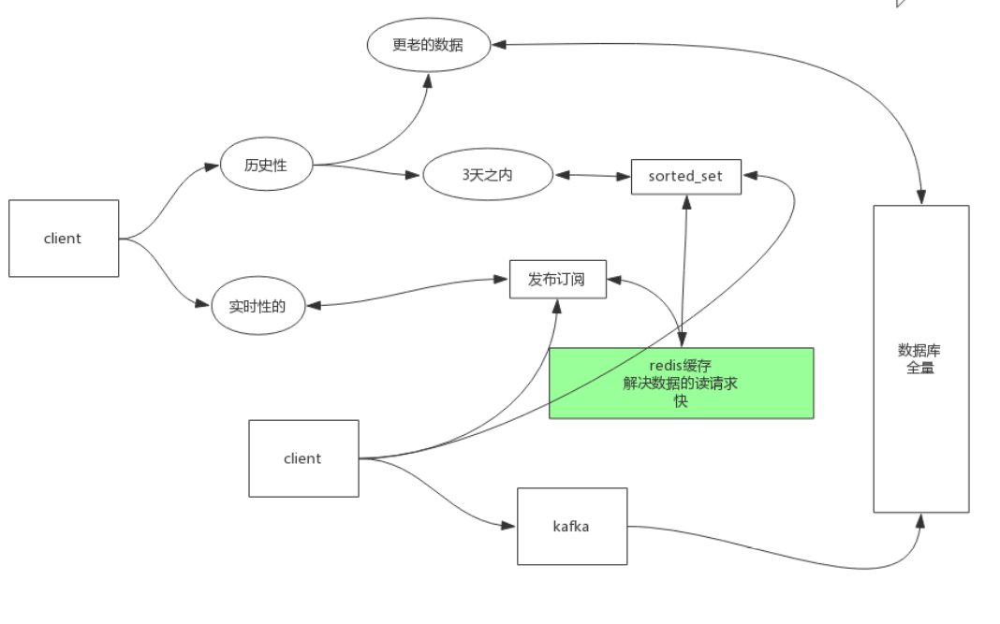
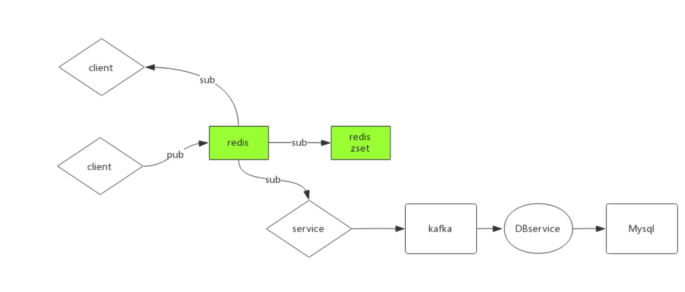
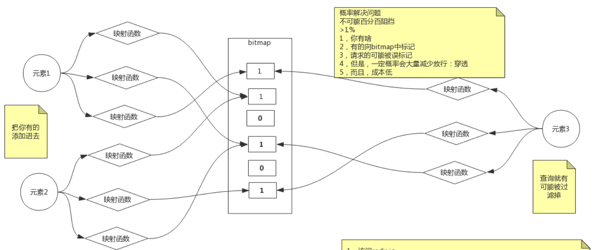
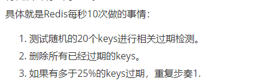

1. Redis订阅发布:
    - `help @pubsub`查看订阅发布相关命令
    - PUBLISH: 监听通道
    - SUBSCRIBE: 从通道中获取数据
    - SUBSCRIBE之前PUBLISH进通道的数据，将不会
    被获取
    - 应用场景:
        - QQ历史记录查询:
            
            - 实时消息: 发布订阅
            - 三天之内历史消息: 缓存
            - 更久之前: 数据库
            - 三者之间的数据同步:
                - 客户端实时监听发布消息，并将消息实时
                更新到缓存，并通过kafka写入磁盘
            - 问题:
                - 订阅实时消息后，来不及将消息写入缓存/磁盘，
                导致查看不到历史数据
            - 解决方案:
                - 使用`redis`事务
                - 多端订阅实时消息
                    
                    - client订阅消息，以实时获取数据
                    - 另一个redis进程订阅当前redis发布的主题，以便及时写入缓存
                    - kafka service 订阅redis发布主题，以便及时写入磁盘
                    
2. Redis事务:
    - 通过`MULTI`开启事务
    - 通过`EXEC`执行事务所有指令
    - `MULTI`与`EXEC`之间的所有指令在`EXEC`之间都静躺在
    队列中等待执行
    - 在多线程访问`REDIS`服务器时，事务之间可能会产生线程安全问题
        - 第一个连接企图`GET K1`
        - 第二个连接企图`DEL K1`
        
        - 根据命令执行情况不同，会有不一样的结果；但REDIS不会回滚事务，
        因为回滚会影响REDIS效率，上述的情况是程序员自己代码书写逻辑的问题
    - Redis为程序员提供的事务安全命令:
        - `watch key`: 保证`key`被改变时，整个事务会被回滚(即队列中所有
        指令都将不再执行); 通过`cas`实时监控`key`的变化
    - `discard`: 可以将整个指令队列清空，同时取消事务 
    
3. redis module: 
    - redis模块: 可以将其它redis本身没有包含的功能和指令，通过 模块引入；比如布隆过滤器 
        - 布隆过滤器:  
        
4. redis pipeline:
    - 一般通过网络执行redis多条命令的情况:
    ###
          Client: INCR X
          Server: 1
          Client: INCR X
          Server: 2
          Client: INCR X
          Server: 3
          Client: INCR X
          Server: 4
    执行需要进行四次网络IO
    - 通过管道传输:
        ````
        (printf "PING\r\nPING\r\nPING\r\n"; sleep 1) | nc localhost 6379
      ```` 
      只需要一次传输
     
5. redis作为缓存需要注意的一些地方:
    - 问题
        - 缓存应该随着业务而变化
        - 缓存的内存大小有限
    - 解决
        - 为缓存设置过期时间:
            - set key时可以通过`ex/px`指定
            - expire/expireat
            - persist取消为key设置的过期时间
            - ttl: 查询剩余时间
        - 过期时间需要注意的一些地方:
            - 设置过期时间后，若进行访问，过期时间不会重置
            - 为key进行rename时，过期时间会延续之前
            - 重新set之后，之前的过期时间失效
        - 内存管理:
            - 可以在redis配置文件中，通过以下两个选项:
                - maxmemory <bytes>: 设置缓存大小
                - maxmemory-policy: 指定缓存淘汰策略，常用以下两个:
                    - allkeys-lru: 所有keys执行lru算法(最近最久未被使用)
                    - volatile-lru: 所有设置了超时时间的keys执行lru算法
        - 过期自动判定的原理:
            - 被动检测: 当key被访问时，会检测当前访问key是否超时；超时的话会剔除
                - 问题: 有一些超时key可能永远不会再被访问，有内存泄漏风险
            - 主动检测: 周期轮询判定
                
        - 缓存穿透，缓存击穿与缓存雪崩:
            - 缓存穿透:
                - 用户集中查询大量在缓存中不存在，数据库中也不存在的词条
                - 解决: 布隆过滤器/预判断
            - 缓存击穿    
                - 用户集中查询某个在数据库中存在的数据，这个数据在某个时刻
                在缓存中正好过期
                - 解决: 设置key永不过期/客户端请求缓存时上互斥锁
            - 缓存雪崩:
                - 缓存中大量key同时失效，压力涌向数据库 
                - 解决: 随机化缓存过期时间
                
 