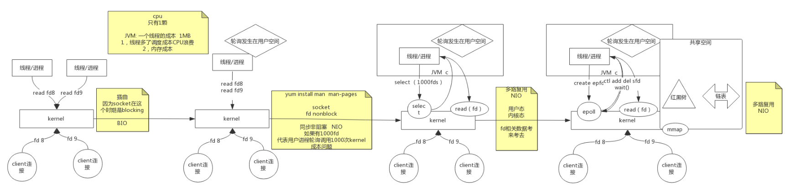

1. Redis的简介:
    - 内存中的数据结构存储系统，可用作`数据库`，`缓存`，`消息中间件`
    - 支持多种类型数据结构:
        
        - strings
            - 字符类型
            - 数据类型
            - bitmaps
        - hashes
        - lists
        - sets
        - sorted sets
    - `redis` vs `memcached`
        
        - `memcached`: 
            - 也是一种`key-value`型数据库
            - `value`相比`redis`，没有类型的概念一说
                - 意味着没有对某种类型数据的特殊操作；
                - 用户查询某个`key`的`value`时，只能
                对数据全量返回，并由用户自己做信息提取(解码)
                - 在网络传输中，`value`体积更大，吃带宽
        - `redis`:
            -  用户需要某种类型的数据，可以在`redis`服务器上
            先处理完之后再发送
                
2. IO发展，BIO -> NIO -> 多路复用NIO -> epoll
     
    - BIO:
        - 早期的`socket`是阻塞的
        - 只能开启多线程，对每个准备就绪的文件描述符进行处理
            - 线程之间切换浪费cpu
            - 单一cpu内，任务调度浪费cpu
    - NIO:
        - `socket`不再阻塞，可以马上返回是否准备就绪
        - 用户空间反复进行系统调用，用户态内核态切换频繁
    - 多路复用 + NIO:
        - 内核提供新的系统调用: `select`，可以一次性
        传入多个文件描述符，内核返回其中准备就绪的部分，
        以供用户态后续调用
        - 每次`select`调用时，需要拷贝大量数据
    - NIO + epoll:
        - 内核提供新的系统调用: `mmap`, 可将用户态的空间
        挂载到内核态空间，从而形成共享空间
        - epoll调用时，内核态会使用红黑树对用户态提供的文件描述符
        进行检查；并将准备就绪的文件描述符扔到链表中，用户态监控
        链表以实时获得准备就绪的文件描述符以便后续操作
        
3. 为什么`redis`采用单线程？
    - 回答此问题最重要的是: 搞清楚多线程的应用场景
        - 多个任务需要完成，其中一些任务有大量IO阻塞操作，浪费CPU
        - 多个任务需要完成，其中一些任务运行时间很长，让用户等起来很费劲，这时候需要雨露均沾
    - redis基于内存，速度非常快，而且几乎没有IO操作，使用多线程百害而无一利
        - 线程之间上下文切换消耗性能
        - 线程之间需要保证数据一致，也很费劲；因为`redis`接收的网络数据可能对
        同一个`key`进行了操作