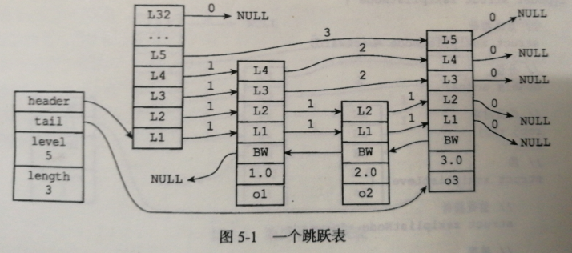

1. SDS(simple dynamic string):
    1) SDS基本结构:
    
        `| struct: sdshdr | len | free | buf |`
        - len: SDS中存储的字符串长度(字节数组buf长度)
        - free: SDS中剩余的可分配空间(字节数组buf空闲部分长度)
        - buf: 普通C字节数组，SDS是二进制安全的
    2) SDS的空间预分配策略:
        
        ````
        1. 如果SDS修改后，SDS的长度将小于1MB，则会分配
       len长度的未使用空间，即free
       2. 如果SDS长度将大于等于1MB，那么程序直接分配1MB
       的未分配空间，即1MBfree
       ````
       
2. 链表:
    1) 普通双向链表
    2) 可自定义的`节点值复制，节点值释放，节点值对比`逻辑
    
3. 字典: 底层依赖于哈希表实现
    1) 哈希表:
       ```` 
        typedef struct dictht {
            dictEntry **table; //哈希表本体
            unsigned long size; //哈希表大小
            
            unsigned long sizemask; //掩码，快速计算索引位置，size - 1
            unsigned long used; // 哈希表中存储元素的个数
        };
        typedef struct dictEntry {
            void *key; // entry的key
       
            union {
                void *val;
                uint64_t u64;
                int64_t s64;
            } v; //entry的value
       
            struct dictEntry *next; //拉链法解决哈希冲突
        }
        typedef struct dict {
            dictType *type; // 包含哈希值计算等一系列方法
            void *privdata; // 传递给type方法的默认参数
       
            dictht ht[2]; //ht[0]为实际存储的哈希表，ht[1]为rehash使用
            int trehashidx; //rehash索引
        } dict;
       ````
    2) rehash(即扩容或缩容):
        
       ````
        1. 时机分析: 
            负载因子: dictht.used / dictht.size
            1) 服务器目前没有执行BGSAVE/BGREWRITEAOF命令，并且负载因子 >= 1
            2) 服务器正在执行BGSAVE/BGREWRITEAOF命令，并且负载因子 >= 5
            3) 负载因子 < 0.1，进行缩容操作
        2. 步骤:
            1) 为dict的ht[1]哈希表分配空间，大小为 
                扩容操作: ceil2n(2*ht[0].used)
                缩容操作: ceil2n(ht[0].used)
            2) 将ht[0]中的数据rehash到ht[1]中
            3) 设置ht[1]为新的ht[0]，并在ht[1]创建空哈希表
        3. 渐进式rehash:
            1) 在对字典进行添加，删除，查找等操作时，每次对
            rehashidx索引上的dictEntry链表进行rehash
            2) rehash完毕时，rehashidx为-1
            3) rehash过程中，修改性的操作统一在ht[1]上执行
       ````
       
4. 跳表:
    
    1) 结构:
    
       ````
        typedef struct zskiplistNode {
            struct zskiplistNode *backward; // 后退指针，该节点在最底层的前一个节点指针
            
            double score; //分值，大小依据
            robj *obj; //存储在跳表中的数据
       
            struct zskiplistLevel {
                struct zskiplistNode *forward;
                unsigned int span; //跨度，通过此值可方便获取某rank的元素
            } level[]; // 层数组，指向该层的下一个跳表节点
        } zskiplistNode;
       
        typedef struct zskiplist {
            struct zskiplistNode *head, *tail;
            unsigned long length; //跳表中节点数量
            int level; //跳表最大层数
        } zskiplist;
       ````
    2) 与一般跳表相比的特殊之处:
        - 跳表节点中的后退指针，可以快速获取某个节点的floor节点和ceil节点
        - 跳表节点中的层数结构，包含span跨度；跨度实际表示的是
        当前节点与下一个节点范围之间的节点个数，通过此值可以快速
        计算出类似: 第k小的节点
        
5. 整数集合(intset):
    1) 结构:
       ````
        typedef struct intset {
            uint32_t encoding; //表示存储的整数位数
            uint32_t length;
            int8_t contents[];
        } intset;
       ````
    2) 当集合加入一个位数更多的整数时，会进行升级；
    将集合中的encoding进行修改，并重新分配contents
    的内存
    
6. 压缩列表:
    1) 结构:
       ````
        | zlbytes | zltail | zllen | entry1..N | zlend |
        1. zlbytes: 4B，整个压缩列表所占的内存字节数
        2. zltail: 4B，最后一个entry的偏移量
        3. zllen: 2B，压缩列表的节点数量
        4. zlend: 0xFF，标记压缩列表末端
        5. entry结构:
            | previous_entry_length | encoding | content |
            1) previous_entry_length: 前一个entry的长度
                1字节: 前一个节点的长度小于254字节
                5字节: 第一字节被设置为0xFE(254)，
                    后面4个字节为前一个entry的长度
            2) encoding:
                00: 1B，长度 <= 63B的字节数组，后面6位位数组长度
                01: 2B，长度 <= (2^14 - 1)B的字节数组
                10: 5B，长度 <= (2^32 - 1)B的字节数组
                11: 1B，后面6位表示整数的位数信息
            3) content: 可为字节数组或整数
       ````
    2) 连锁更新: 由entry结构的`previous_entry_length`长度
    可变性导致，在动态新增/删除节点时，可能需要对后面的节点重新
    分配内存，因为前一个entry长度发生变化后，`previous_entry_length`
    大小也会发生变化
    