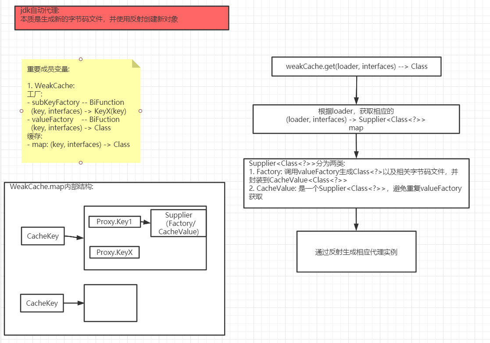
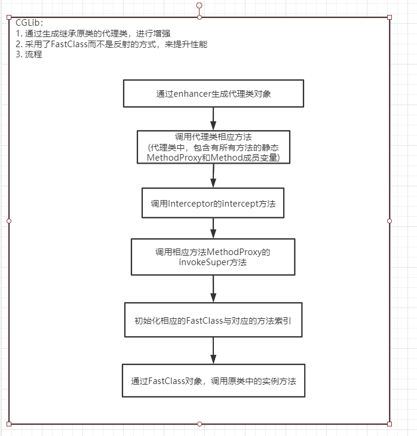

1. jdk动态代理:
    
2. CGLib动态代理:
    
    - CGLib在代理过程会生成三个class文件，分别是:
        - 代理类
        - 代理类的FastClass
        - 原类的FastClass
3. 早期Java反射调用与FastClass调用的对比:
    - 早期Java反射调用，主要以下几点导致性能较差:
        - 需要从类中的所有方法，搜索指定方法；
        过程还包含一些Accessible的判断，比较麻烦
        - 因为同一方法名可能存在重载问题，所以方法
        调用时都是可变参数；这不利于编译器的编译时
        优化，从而导致代码性能低下；这是最主要的原因
    - FastClass技术:
        - 为每一个类单独生成一个FastClass，在FastClass
        类中，会为每一个方法单独指定索引；当需要获取某一个
        方法时，可直接通过签名指定方法拿到对应索引，并通过
        索引调用相应方法；由于调用在编译时就可以确定方法参数，
        因此可以被编译器优化
    - 值得注意的是，在jdk1.7之后，Java反射引入了MethodHandle
    的机制，使得编译器优化可以进行；因此之后的Java反射效率比起
    CGLib，差距不大