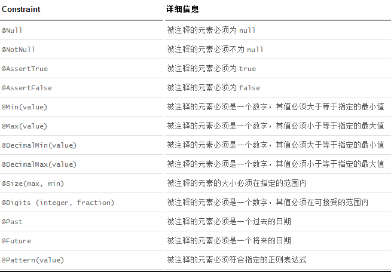

### pom.xml
````xml
<dependency>
    <groupId>org.hibernate</groupId>
    <artifactId>hibernate-validator</artifactId>
    <version>5.1.0.Final</version>
</dependency>
````

### Bean
````java
import org.hibernate.validator.constraints.Email;
import org.hibernate.validator.constraints.Length;
import org.springframework.format.annotation.DateTimeFormat;
import javax.validation.constraints.NotNull;
import javax.validation.constraints.Past;
import java.util.Date;

public class User {

    private Integer id;
    @NotNull
    @Length(min = 5,max = 10)
    private String name;
    private Integer age;
    private String gender;
    @Past
    @DateTimeFormat(pattern = "yyyy-MM-dd")
    private Date birth;
    @Email
    private String email;

    public User() {
    }

    public Integer getId() {
        return id;
    }

    public void setId(Integer id) {
        this.id = id;
    }

    public String getName() {
        return name;
    }

    public void setName(String name) {
        this.name = name;
    }

    public Integer getAge() {
        return age;
    }

    public void setAge(Integer age) {
        this.age = age;
    }

    public String getGender() {
        return gender;
    }

    public void setGender(String gender) {
        this.gender = gender;
    }

    public Date getBirth() {
        return birth;
    }

    public void setBirth(Date birth) {
        this.birth = birth;
    }

    public String getEmail() {
        return email;
    }

    public void setEmail(String email) {
        this.email = email;
    }

    @Override
    public String toString() {
        return "User{" +
                "id=" + id +
                ", name='" + name + '\'' +
                ", age=" + age +
                ", gender='" + gender + '\'' +
                ", birth=" + birth +
                ", email='" + email + '\'' +
                '}';
    }
}
````

### 使用
    - @Valid
    - BindingResult
````java
import com.mashibing.bean.User;
import org.springframework.stereotype.Controller;
import org.springframework.validation.BindingResult;
import org.springframework.web.bind.annotation.RequestMapping;

import javax.validation.Valid;

@Controller
public class DataValidateController {
    @RequestMapping("/dataValidate")
    public String validate(@Valid User user, BindingResult bindingResult) {
        System.out.println(user);
        if (bindingResult.hasErrors()) {
            System.out.println("验证失败");
            return "redirect:/index.jsp";
        } else {
            System.out.println("验证成功");
            return "hello";
        }
    }
}
````
