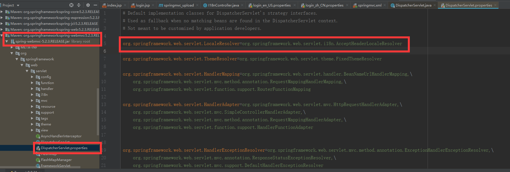

### 默认localeResolver


## 自定义localeResolver流程

### 统一页面jsp编写
````jsp
<%@ page contentType="text/html;charset=UTF-8" language="java" %>
<%@ taglib prefix="fmt" uri="http://java.sun.com/jsp/jstl/fmt"%>
<html>
<head>
    <title>Title</title>
</head>
<body>
<h1><fmt:message key="welcomeinfo"/></h1>
<form action="login" method="post" >
    <fmt:message key="username"/>: <input type="text" name="username"/><br><br>
    <fmt:message key="password"/>: <input type="password" name="password"/><br><br>
    <input type="submit" value="<fmt:message key="loginBtn"/>"/>
    <a href="i18n?locale=zh_CN">中文</a><a href="i18n?locale=en_US">英文</a>
</form>
</body>
</html>
````

### properties配置文件
login_en_US.properties
````properties
welcomeinfo=welcome to mashibing.com
username=USERNAME
password=PASSWORD
loginBtn=LOGIN
````
login_zh_CN.properties
````properties
welcomeinfo=欢迎进入马士兵教育
username=用户名
password=密码
loginBtn=登录
````

### LocaleResolver编写
````java
import org.springframework.web.servlet.LocaleResolver;

import javax.servlet.http.HttpServletRequest;
import javax.servlet.http.HttpServletResponse;
import java.util.Locale;

public class MyLocaleResolver implements LocaleResolver {
    /**
     * 解析并返回locale
     * @param request
     * @return
     */
    @Override
    public Locale resolveLocale(HttpServletRequest request) {
        Locale locale = null;
        String localeStr = request.getParameter("locale");
        if(localeStr!=null && ! "".equals(localeStr)){
            locale = new Locale(localeStr.split("_")[0],localeStr.split("_")[1]);
        }else{
            locale = request.getLocale();
        }
        return locale;
    }

    /**
     * 不支持设置locale的信息
     * @param request
     * @param response
     * @param locale
     */
    @Override
    public void setLocale(HttpServletRequest request, HttpServletResponse response, Locale locale) {
        throw new UnsupportedOperationException(
                "Cannot change HTTP accept header - use a different locale resolution strategy");
    }
}
````

### spring配置文件
````xml
<?xml version="1.0" encoding="UTF-8"?>
<beans xmlns="http://www.springframework.org/schema/beans"
       xmlns:xsi="http://www.w3.org/2001/XMLSchema-instance"
       xmlns:context="http://www.springframework.org/schema/context"
       xmlns:mvc="http://www.springframework.org/schema/mvc"

       xsi:schemaLocation="http://www.springframework.org/schema/beans http://www.springframework.org/schema/beans/spring-beans.xsd http://www.springframework.org/schema/context https://www.springframework.org/schema/context/spring-context.xsd http://www.springframework.org/schema/mvc https://www.springframework.org/schema/mvc/spring-mvc.xsd">
<mvc:default-servlet-handler></mvc:default-servlet-handler>
<mvc:annotation-driven></mvc:annotation-driven>
<context:component-scan base-package="com.mashibing"></context:component-scan>

<bean class="org.springframework.web.servlet.view.InternalResourceViewResolver">
    <property name="prefix" value="/WEB-INF/page/"></property>
    <property name="suffix" value=".jsp"></property>
</bean>
<bean id="messageSource" class="org.springframework.context.support.ResourceBundleMessageSource">
    <property name="basename" value="login"></property>
</bean>
    <!--配置区域信息解析器-->
    <bean id="localeResolver" class="com.mashibing.MyLocaleResolver"></bean>
</beans>
````

## 推荐的国际化方式: SessionLocaleResolver + LocaleChangeInterceptor
- SessionLocaleResolver将当前的locale设置到session中，并从session中获取
- LocaleChangeIntercptor负责用户修改locale时，将request中对应的locale进行修改
    - 具体是: 无视请求头中的Accept_Language，使用请求体中的locale参数作为新的locale
