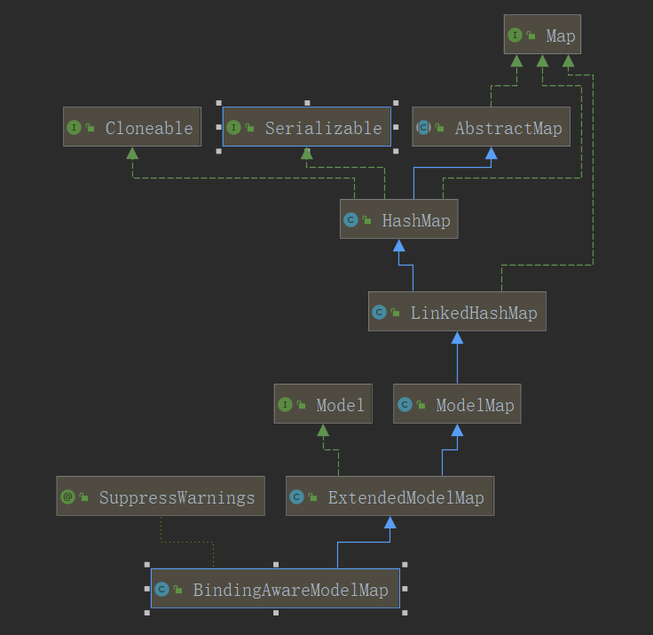

### BindingAwareModelMap:

````java
import org.springframework.stereotype.Controller;
import org.springframework.ui.Model;
import org.springframework.ui.ModelMap;
import org.springframework.web.bind.annotation.RequestMapping;

import java.util.Map;

@Controller
public class OutputController {

    @RequestMapping("output1")
    public String output1(Model model){
        model.addAttribute("msg","hello,Springmvc");
        return "output";
    }

    @RequestMapping("output2")
    public String output2(ModelMap model){
        model.addAttribute("msg","hello,Springmvc");
        return "output";
    }

    @RequestMapping("output3")
    public String output1(Map map){
        map.put("msg","hello,Springmvc");
        return "output";
    }
}
````

