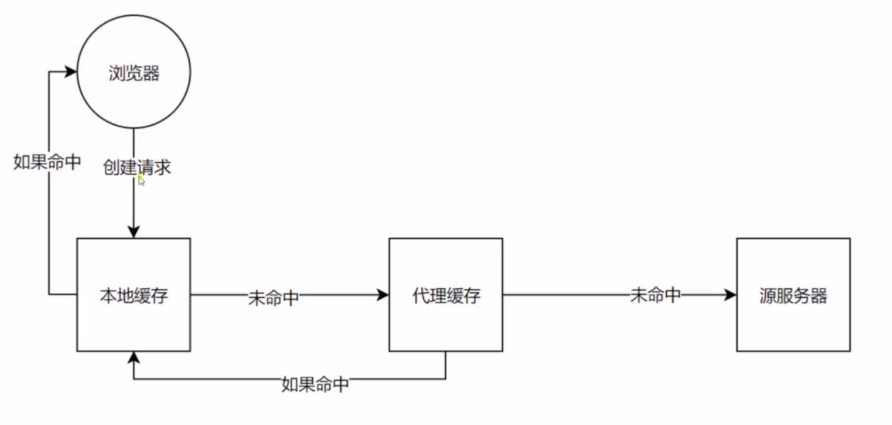

Http对缓存的控制:
1. Cache-Control请求头可包含的属性:
    - `private`: 本地浏览器可作缓存，代理服务器不可
    - `public`: 本地服务器与所有代理服务器均可做缓存
    - `no-cache`: 本地服务器可作缓存，但需要到服务器校验
    - `no-store`: 不可做缓存，必须到服务器获取最新数据
    - `max-age`: 缓存时间
    - `s-maxage`: 代理服务器缓存时间
    - `max-stale`: max-age之后，max-stale之前仍可直接获取缓存
    
2. 非no-cache的强缓存和no-cache的协商缓存:
    - 非no-cache:
        
        - 从浏览器处获取缓存
            - 若缓存未过期，直接获取，而不去服务器作校验
            - 若缓存过期，则会去请求服务器
        - `max-age`时间到时，过期，再次请求时会去请求服务器
        - 由于此方案在缓存生效期间完全不去访问服务器，所以
            - 性能很高
            - 数据实时性不强，但可通过对资源进行hash，并将
            hashCode附加到url上，从而使浏览器能够动态感知
            资源的修改
    - no-cache:
        - 两个步骤:
            - 服务器发送请求时，浏览器会向服务器发送确认请求来
            判断当前浏览器缓存资源是否有效
            - 若服务器返回304，则表示有效；否则从服务器直接获取
            资源
        - `LastModified`与`ETags`
            - `LastModified`是第一次请求/成功请求(200)时服务器
            响应的响应头，其值代表请求资源的最后一次修改时间
            - `ETags`是第一次请求/成功请求(200)时服务器
            响应的响应头，其值代表请求资源的唯一标识
        - `LastModified`的使用:
            - 服务器在发送确认请求时，会在请求头附带`if-modified-since`，
            与服务器的资源修改时间对比，获取资源是否修改的信息返回给客户端
        - `ETags`的使用:
            - 服务器在发送确认请求时，会在请求头附带`if-none-match`,
            与服务器的资源标识符作对比，获取资源是否修改的信息返回给客户端
        - `ETags`的好处是，资源的修改是实实在在的，而`LastModified`实质内容可能没有变化