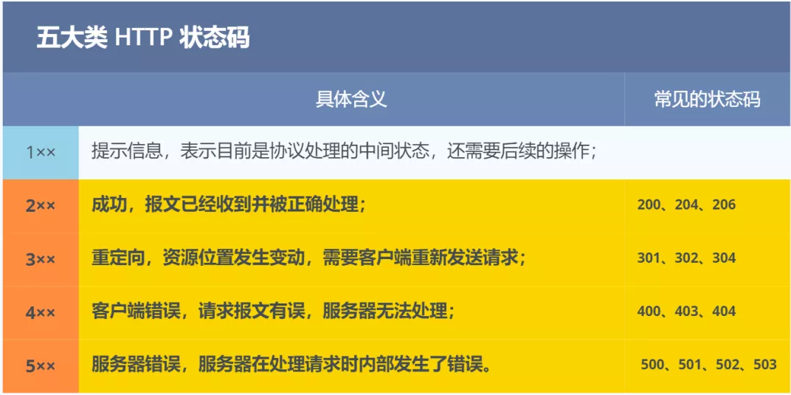

http状态码:
    
1. 1xx：请求已接收，继续处理
2. 2xx：成功
    - 200：OK，客户端请求成功
	- 204：No Content，无内容返回。不会刷新页面
	- 206：Partial Content，服务器已完成部分GET请求，响应报文中包含Content-Range指定范围的实体内容
3. 3xx：重定向
	- 301：Moved Permanently，永久重定向，资源已永久搬到其他地方
	- 302：Found，临时重定向，资源临时搬去别的地方
	- 303：See Other，临时重定向，和302一样，只是告诉客户端使用GET
	- 307：Temporary Redirect，临时重定向，和302一样，POST不会变成GET
    - 304：Not Modified，客户端发送的附带条件请求，条件不满足
4. 4xx：客户端错误
	- 400：Bad Request，客户端语法错误
	- 401：Unauthorized，请求未授权，这个状态码必须和www-authenticate报头域一起用
	- 403：Forbidden，服务器收到请求，但是拒绝提供服务
	- 404：Not Found，请求资源不存在，url不存在
	- 415：Unsupported media type，不支持的媒体类型
5. 5xx：服务端错误
	- 500：Internal Server Error，服务端错误
	- 501：Not Implemented，客户端请求功能还不支持
	- 502：bad gateway网关错误
	- 503：Service Unavailable，服务端当前不能处理请求，过一段时间才恢复
    - 504：gateway timeout
