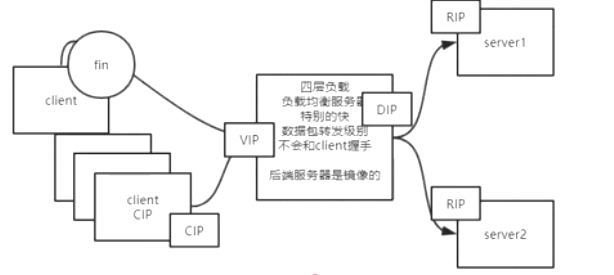

1. LVS负载均衡结构:
    
    1. 问题
        - LVS服务器可能挂
        - RS也可能挂
    2. 解决单点故障的两个思路:
        - 主备
        - 主主
    3. 主备模式需要考虑的两个问题:
        - 方向性: 主向从通告？从定期轮询主？
        - 效率性: 主挂了之后如何快速选举出主？
    4. 主备与主从的区别:
        - 主备: 主提供服务，从作为备胎不干活
        - 主从: 主和从一起向外提供服务，主可能产生单点故障；
        对主会做主备保证HA
    5. 如何判断RS挂了?
        - 定期请求RS，校验状态码
    
2. keepalived在LVS保证HA的过程中做的事:
    - MASTER 安装keepalived监控自己服务
    - MASTER 通过自己还或者，BACKUP 监听MASTER状态，
    MASTER挂了之后，keepalved在一群BACKUP中推举出一个新MASTER
    - 配置: 写配置文件，配置VIP，添加IPVS配置(vrrp: 虚拟路由冗余协议)
    - `MASTER`和`BACKUP`定期向所有`RS`发送请求，检验
    RS生存状况
    - `keepalived`可以作为保证HA的应用程序使用，而不仅仅只用于
    `LVS`
    
3. keepalived实验过程:
    - node01, node04分别代表虚拟服务器的主和备
    - node02, node03代表`RS`
    - node01，node04配置`keepalived`:
        - 安装`keepalived`
        - `/etc/keepalived/keepalived.conf`修改配置
            - vrrp_instance: 配置虚拟服务器；一台机器可以配置多个虚拟服务器；
            相当于网卡配置
            - virtual_server
                - 配置虚拟服务器
                - 配置RS
                    - 需要配置`HTTP_GET`，虚拟服务器
                    才可以定期向特定路由发送请求，以保证`RS`存活