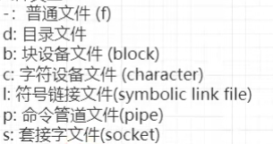

1. 文件详细信息的字段描述:
    
    - 第一个`-`: 文件类型
        - 
    - 9个字母:
        ````
        r: 可读
        w: 可写
        x: 可执行
        ````
        - 前三个: 文件所属者(创建者)的权限
        - 中间三个: 与文件所属者同组的用户的权限
        - 最后三个: 其它用户的权限
    - `.`: 分隔符
    - `l`: 连接(软硬)
    - `root`: 创建用户
    - `root`: 用户组名
    - 最后更新时间