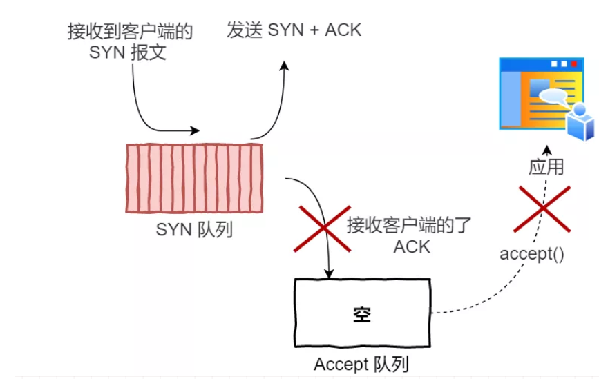

TCP连接建立:
1. TCP三次握手过程:
    
    - 客户端请求建立连接，设置TCP头中SYN位为1
        - 进入SYS_SENT状态，等到服务器的ACK
        - 如果服务器ACK丢了或因为网络延迟导致过期，会重发连接请求
    - 服务端设置`SYN, ACK`为1，将报文发送给客户端
        - 进入SYN_RCVD状态，等待客户端的ACK
        - 注意这个时候服务端并没有建立连接
    - 客户端建立连接并回应ACK，并且此次请求可携带数据
    
2. 三次握手的原因:
    
    - 假设是两次握手，那服务器在接收到客户端第一次发送的SYN请求时，
    就会创建连接
    - 假设服务器回应的ACK包因为网络原因延迟到达，客户端会重新发送
    SYN请求，结果是建立了两条一样的TCP连接
    
3. SYN攻击:
    
    - SYN队列
    - Accept队列
    - 服务端在三次握手过程的状态转换:
        
    - 被SYN攻击时
        
        