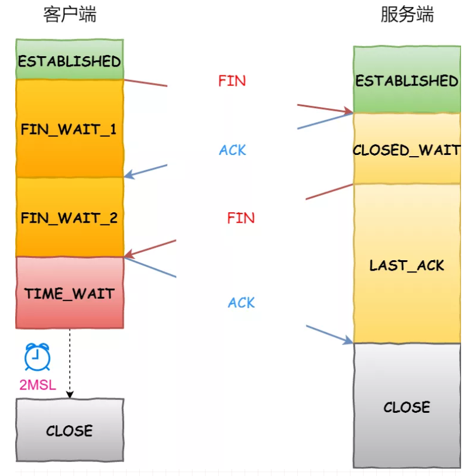

11. TCP断开连接的四次握手:
    
    - 相比建立连接三次握手的变化:
        - 服务端第一次响应不再是`ACK和FIN`一起，导致多了一次连接
            - 分离的原因: 客户端请求断开连接时，服务端可能还有一些请求
            尚未处理完成，此时不能贸然断开连接
    - 为什么`Time_WAIT`等待时间是`2MSL`
        - MSL: 报文最大生存时间，网络上超过此时间的报文将会被抛弃
        - 为了保证本次连接发送的`FIN,ACK`不会影响到下次同名连接的信息发送
    - 四次握手的缺陷:
        - 可能出现一种情况，第三次握手的"某一次"`FIN`成功发送到客户端，
        但是客户端的`ACK`发送超时，导致`FIN`多次发送，但是之后的`FIN`
        发送都失败了，这时候可能客户端被关闭了，而服务端连接还未关闭。
        之后服务端再也不可能收到`ACK`了，也就是可能出现服务端无法关闭
        连接的情况
        - 解决这种情况的一种办法是，重试到一定次数之后，有非常大的概率
        `FIN`已经发送到客户端，所以服务端可以关闭连接
    - 为什么第四次握手(最后一次发送`ACK`)一定要由发送方来做？
        - 假设没有最后一次`ACK`发送，而是接收方在发送完`FIN`之后
        就关闭了连接，则`FIN`发送失败时，发送方无法关闭连接；并且，
        发送方无法预估服务端剩余任务的处理情况，这时候不能贸然地
        像上面重试那样关闭连接
    - 个人对第四次发送`ACK`的理解:
        - 就如上面分析缺陷里面解决方案说的那样，其实服务端最终一定能
        关闭连接，那么为什么还要发送这第四次`ACK`呢？
        - 个人认为是提高服务端连接利用，毕竟成功了就能马上释放服务端连接了    
    