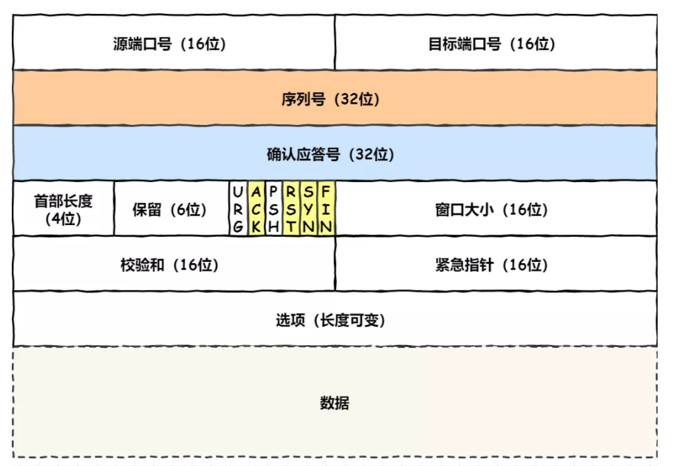

TCP协议基本认识:
1. TCP头部格式:

    
    - 重要的头部属性:
        - 序列号: 第一次请求时生成的随机数，之后+1，是TCP段的唯一标识；
        用来解决网络包乱序问题
        - 确认应答号: 可以认为，在此应答号之前的所有网络包都已成功发送
        - SYN: 请求连接标识
        - ACK: 确认应答
        - RST: TCP连接出现异常，必须强制断开连接
        - FIN: 之后不再会主动发送数据，**期望**断开连接
        
2. TCP概念:
    - 面向连接的
    - 可靠的
    - 基于字节流的
    - 传输层通信协议

3. TCP连接的概念:
    - socket，用户会话，由IP地址和端口号组成
    - 序列号，tcp连接序号
    - 窗口大小，滑动窗口相关，做流量控制
    
4. 唯一确定一个TCP连接:
    - 源地址
    - 源端口
    - 目的地址
    - 目的端口
    
5. UDP和TCP的比较:
    - 连接:
        - TCP面向连接
        - UDP无连接
    - 服务对象:
        - TCP只支持一对一
        - UDP支持一对一，一对多，多对多
    - 可靠性:
        - TCP可靠
        - UDP不保证可靠
    - 拥塞控制，流量控制:
        - TCP有
        - UDP没有
    - 首部开销
        - TCP可变长
        - UDP固定头部