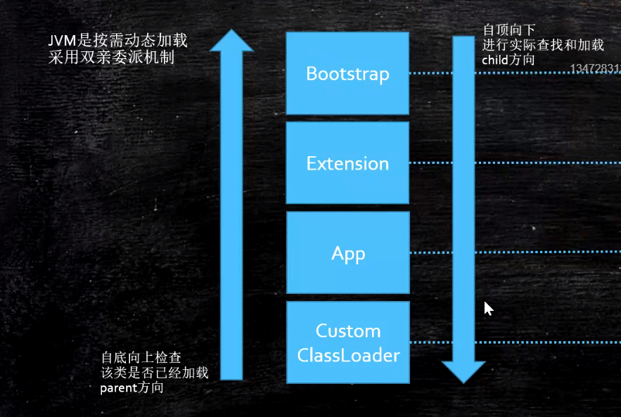
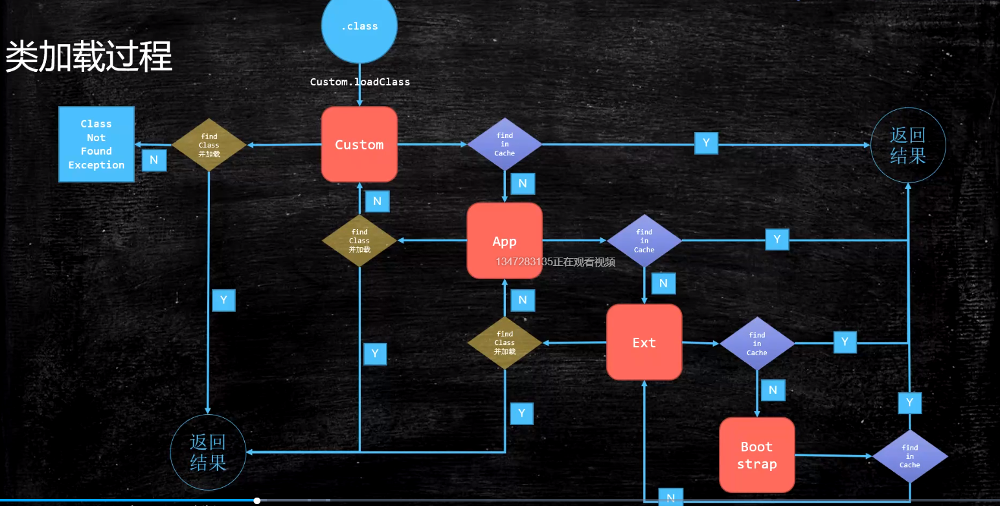

1. 类加载的三个步骤:
    - 将类从磁盘load到内存
    - Linking
        - Verification: 验证类文件格式
        - Preparation: 为类的静态变量赋**默认值**
        - Resolution: 将类、方法、属性等符号引用解析为直接引用
            - 符号引用: 指向Class **常量池** 的引用
            - 直接引用: 直接指向**堆/方法区**相应位置的引用
    - Initializing: 调用类初始化代码，给静态成员变量赋初始值
    
2. Loading过程详解:
    
    - 类加载器:
        - `BootStrap`: 使用C++实现，Java中没有具体Class与之对应，打印时为null
            - 加载核心类，如`String, rt.jar, charset.jar`
        - `Extension`: 父加载器为`BootStrap`
            - 加载`jre/lib/ext/*.jar`，或使用`Djava.ext.dirs`指定
        - `App`: 父加载器为`Extension`
            - 加载`classpath`
        - `CustomClassLoader`: 自定义类加载器，父加载器为`App`
        - 一些注意点:
            - 父加载器不是加载加载器的加载器，也不是该加载器的父类加载器
                - 使用: `xxxClass.getClass().getClassLoader().getClass().getClassLoader()`可以获得加载加载器的加载器，一般都是`BootStrap`
                - 使用: `xxxClass.getClass().getClassLoader().getParent()`可以获得加载器的父加载器
    - `Launcher`类中包含了各种类加载器的实现
    - 使用双亲委派模型:
        
        - 首先在当前`Loader`找缓存
            - 找到 -> `return`
            - 找不到 -> 父类找
            - 父类找不到 -> `findClass`
                - `findClass`成功加载 -> `return`
                - `findClass`找不到 -> 抛出异常
        - 在编写自己的`ClassLoader`时，除了`findClass`需要自己编写外，
        其它的都是jdk写好的
        - 为什么要使用双亲委派模型？
            - 为了安全考虑，如果不使用，则代码编写者可以编写一个
            与核心库中名字完全一样的类，来覆盖原来的类，从而造成安全问题
            - 加载过一次的类，没必要再加载第二次    
    - 打破双亲委派模型:
        - 如何打破: 重写 `loadClass` 方法
            - 重写之后，可以不执行`查找缓存`, `寻找父加载器`的逻辑
            
        - Java的打破历史:
            - JDK1.2之前，自定义ClassLoader都必须重写loadClass()
            - ThreadContextClassLoader可以实现基础类调用实现类代码，通过thread.setContextClassLoader指定
            - 热启动，热部署
                - osgi tomcat 都有自己的模块指定classloader（可以加载同一类库的不同版本）

    - `LazyLoading`五种情况:
        - `new getstatic putstatic invokestatic`指令，访问final变量除外
        - `java.lang.reflect`对类进行反射调用时
        - 初始化子类的时候，父类首先初始化
        - 虚拟机启动时，被执行的主类必须初始化
        - 动态语言支持`java.lang.invoke.MethodHandle`解析的结果
        为`REF_getstatic REF_putstatic REF_invokestatic`
        的方法句柄时，该类必须初始化
    - Java三种执行模式:
        - `-Xmixed`: 默认
        - `-Xint`: 改为纯解释器
        - `-Xcomp`: 改为纯编译
        - `-XXCompileThreshold`: mixed状态下检测热点代码次数限制
        