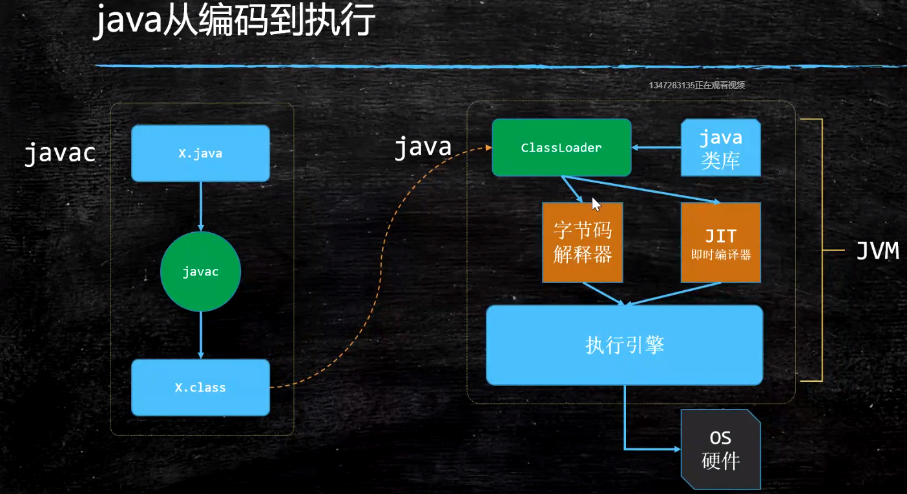

1. 什么是JVM?
    
    - JVM 是在OS之上的虚拟机器，有自己的CPU，内存管理，汇编语言...

2. JVM 是一种跨语言的规范，只要某种语言能够翻译成 class 文件格式，
就能在JVM上跑

3. 常见的JVM:
    - Hotspot
    - JRockit
    - Microsoft VM
    - Taobao VM
    - Liquid VM
    - azul zing
    
4. Jdk, JRE and JVM
    
    
5. class 文件结构:
    
    - 前四个字节: CAFE BABE，固定的Magic Number
    - constant_pool_count
    - constant_pool_count - 1 个常量的定义, 标号从1开始，0是为了让那些不引用常量池引用的
    对象有标记
    - 重点结构:
        - Method:
            - Code
                - LineNumberTable: 汇编指令与实际代码行数的映射表
                - LocalVariableTable: 方法本地变量表
        - access_flags 是使用 或 运算的
        - 几个比较奇怪的 java类型-class类型 映射
            - long -> J
            - boolean -> Z
            - array -> [
            - Object -> Lfullclassname