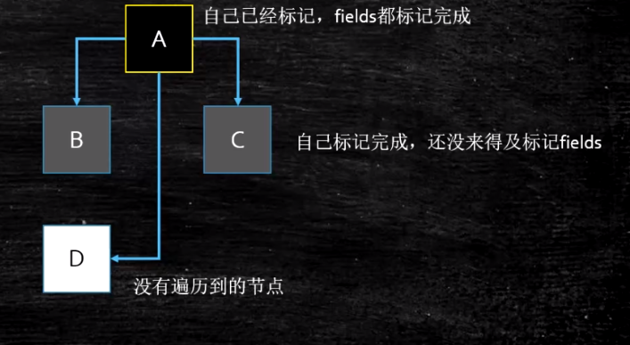

1. 什么是垃圾: 
    没有任何引用指向的一个对象或者多个对象(循环引用)

2. 定位垃圾的两种方式:
    - 引用计数: 无法定位循环引用垃圾
    - 可达性分析:
        - 根的概念: 
            - JVM Stack
            - 本地方法栈
            - 运行时常量池
            - 方法区中的静态引用
            - 被同步锁(synchronized)持有的对象
        
3. 三种基本的垃圾收集算法:
    - mark sweep: 标记清除
        
        - 算法简单，存活对象多的时候效率比较高；
        多用于老年代的垃圾回收
        - 两边扫描，效率偏低
        - 碎片化
    - copying: 标记复制
        
        - 适用于存货对象较少的情况，效率非常高(区域垃圾回收很块)；
        一般用于新生代的垃圾回收
        - 无碎片，但空间浪费严重
    - mark compact: 标记压缩
        
        - 既不会产生内存碎片，也不会浪费空间
        - 效率比mark sweep更低
        - 一般用于老年代的垃圾回收
        
4. 分代收集理论:
    - 弱分代假说: 绝大多数对象朝生夕灭
    - 强分代假说: 熬过越多次垃圾收集过程的对象，越难以消亡
    - 跨代引用假说: 跨代引用相对于同代引用来说仅占少数
    - 新生代的常见垃圾回收模型: Eden + S1 + S2
        
        - Eden和其中一个Survivor区相当于内存分配的位置
        - 另外一个Survivor区相当于copying算法中的空闲区域
        - 可能出现的一些情况:
            - 一些对象年龄超过阈值(CMS:6, others:15)，进入老年代
            - 动态年龄: 当 Eden + Sx 中存活对象数量超过 Sy 的一半时，
            会让年龄最老的一批对象提前进入老年代
            - 分配担保: YGC期间survivor区空间不够，会让多出来的对象
            提前进入老年代
        - 栈上分配(什么对象会被分配到栈上):
            - 线程私有小对象
            - 无逃逸(对象只在某个代码块中被用到)
            - 支持标量替换(某个对象可以写成多个基本类型变量的形式)
        - TLAB(Thread Local Allocate Buffer):
            - 占用eden，默认1%
            - 多线程的内存分配可以避免竞争
    
5. 一些算法细节:
    - 根节点枚举:
        - 逐个检查所有可能产生root的内存区域，时间开销极大
        - 枚举过程为保证并发安全，会STW
        - 使用OopMap解决上述问题
    - 安全点:
        - 进行GC前，必须等待所有用户线程到达离他们各自最近的
        安全点之后，才能开始GC
        - 两种方案实现:
            - 抢先式中断(Preemptive Suspension)
                - 系统首先中断所有线程
                - 检测线程是否在安全点中断
                    - 不在，恢复该线程，重复中断
                    - 直到所有线程都到达安全点
                - 几乎没有虚拟机实现使用此方案
            - 主动式中断(Voluntary Suspension)
                - 设置一个标志，所有线程轮询看是否需要GC
        - 设置位置:
            - 方法调用
            - 循环跳转
            - 异常跳转
    - 安全区域:
        - 对于执行中的程序，使用安全点的概念来通知GC
        - 对于那些被阻塞的线程，使用安全区域
        - 什么是安全区域:
            - 在安全区域这个代码片段中，引用关系不会发生变化
            - 即当线程在这个安全区域中时，系统可以自由开始GC，而
            不用担心因此线程执行导致并发安全问题
        - 使用方式:
            - 线程进入安全区域时，标识自己进入了安全区域
            - 虚拟机进行GC时，不必理会进入了安全区域的线程
            - 线程要出安全区域时，需要检测虚拟机是否正在GC
                - 是: 陷入等待状态
                - 否: 无事发生
    - 跨代引用，跨区引用的GC解决方案: 记忆集与卡表
        - 卡表: 实现记忆集的一种经典方式
            - 本质: 字节数组
            - 数组每个索引代表某个内存区域，通过值来标志该区域
            是否存在跨代/区引用
    - 三色标记:
        
        - 三色节点:
            - 黑色: 所有子节点已检查完毕，并且黑色的节点以后不会再检查
            - 灰色: 该节点已被检查，但子节点有一部分未标
            - 白色: 未标节点
        - 漏标的两个充分必要条件
            - 插入一条或多条从黑色对象到白色对象的引用
            - 删除全部从灰色对象到该白色对象的引用
        - 解决方案:
            - 增量更新(CMS使用)
            - 原始快照(SATB, G1使用)
            
6. 各种垃圾收集器:
    
    - Serial + Serial Old: 既逻辑分代，又物理分代
        - jdk早期使用的垃圾收集方式
        - Serial单线程进行copying垃圾回收，用于新生代
        - Serial Old单线程进行mark compact垃圾回收，用于老年代
    - Parallel Scavenge + Parallel Old: 既逻辑分代，又物理分代
        - jdk1.8默认使用的垃圾收集方式
        - Parallel Scavenge多线程进行copying垃圾回收，用于新生代；
        更加注重吞吐量
        - Parallel Old多线程进行mark compact垃圾回收，用于老年代；
        更加注重吞吐量
    - ParNew + CMS: 既逻辑分代，又物理分代
        - ParNew是一款为了迎合CMS而产生的垃圾收集器，相当于是Serial的
        并发版本
        - CMS(Concurrent Mark Sweep):
            - 里程碑式的垃圾回收器，开启了并发回收的时代
            - 四个过程:
                - 初始标记: STW, 只找出所有GCRoots
                - 并发标记: 与程序并发执行，整个GC过程80%的时间都消耗在这里
                - 重新标记: STW，给并发标记过程可能产生的问题擦屁股
                - 并发清理: 与程序并发执行，清理垃圾
            - CMS的三个问题:
                - 并发标记与并发清理占用CPU，导致整体程序吞吐量下降
                - 并发清理过程产生浮动垃圾
                    - Concurrent Mode Failure: CMS运行期间预留的内存无法满足程序分配新对象的需要
                    - 使用 `-XX:CMSInitiatingOccupancyFraction`来设置阈值
                - mark sweep导致的内存碎片
                    - Promotion Failed: 无法找到足够大的连续空间来分配大对象
                - 当产生`Concurrent Mode Failure`和`Promotion Failed`时，
                CMS都会停止所有用户线程，启用Serial Old去进行FGC，效率非常低
    - G1: 一种服务端应用使用的垃圾收集器，能保证高响应时间，同时保持较高吞吐量；
        
        - 吞吐量: 大概是PS + PO 的 85%~90%
        - 结构分析:
            - 随着内存逐渐加大，传统分代(两块区域)已经满足不了服务端对响应时间的需求，
            G1开创了收集器面向局部收集的设计思路和基于Region的内存布局形式
            - `Region`: G1单次回收的最小单元，所有逻辑内存区域都是Region的整数倍
            - `Humongous Region`: 占用内存超过Region一半以上的大对象
        - 特点: 可以预测GC暂停时间
        - 基本概念:
            - Region
            - CSet: Collection Set, G1进行GC(MixedGC)时回收的区域
            - RSet: Remembered Set, G1记忆集
                - 每个Region都存在一个记忆集
                - 记忆集存储: 别的Region指向自己的指针，并标记这些指针的卡页范围
                    - 相当于是一个HashMap
                    - Key: 别的Region的起始地址
                    - Value: 集合，存储卡表索引号
                - 进行GC时，扫描RSet，可以准确定位跨区引用
        - G1的一些特性:
            - 新老年代比例动态调整:
                - 5% ~ 60%, G1预测时间的基准；会保证在预测时间内进行完GC，
                所以当预测GC时间较长时，会自动缩减
            - G1的垃圾回收方式:
                - YGC: Eden + 2Survivor
                - MixedGC:
                    - 初始标记: STW，同CMS
                    - 并发标记: 使用三色标记，漏标问题使用SATB解决
                    - 最终标记: 处理SATB记录
                    - 筛选回收: 暂停所有用户线程，在用户设定的预测时间内完成GC
                        - 为什么要STW?
                            - G1停顿时间用户可控
                            - G1同时也要尽量保持高吞吐量
                - FGC: 在内存分配速度极快时，依然会产生FGC
                    - 解决:
                        - 扩内存
                        - 提高CPU性能
                        - 降低MixedGC触发阈值，让MixedGC提早发生(默认45%)
        - G1实现面临的三个挑战:
            - Region区域之间的跨代引用
            - 并发标记，保证用户线程和收集线程的互不干扰
            - 建立可靠的停顿预测模型
        - G1一些面试问题:
            - 为什么G1使用SATB而不是增量更新?
                - G1使用RSet解决跨代引用，其中RSet包含指向引用该对象的指针，
                使用SATB可以在并发标记，重新标记时快速处理，减少STW
                - 增量更新有ABA问题，影响预测模型等的判断
            - SATB中的写屏障:
                - 指写前屏障 + 写后屏障来维护RSet的过程
            - G1与CMS的比较:
                - G1优势:
                    - 可以设定预测时间
                    - 按收益动态确定回收集
                    - 使用`mark compact`和`copying`，不会产生内存碎片
                - CMS优势:
                    - 相比G1的RSet，内存占用少
                    - 并发标记，重新标记算法简单
        
    - ZGC, Shenandoah