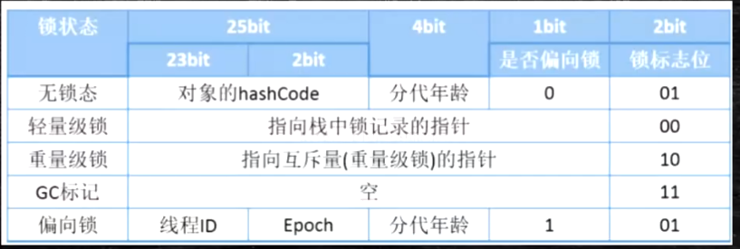

一道面试题:
> 对象内存分配过程
>
> 对象内存布局
>
> 对象头具体包括什么
>
> 对象定位方法
>
> `Object o = new Object()`，在内存中o占用了多少字节

1. 对象内存分配过程:
    - 检查类是否已加载:
        - 未加载:
            - Load
            - Linking: Verification, Preparation, Resolution
            - Initializing
    - 执行`new`指令，分配内存
    - 静态成员变量默认初始化
    - 对象头设置
    - 执行构造方法

2. 对象内存布局:
    - 对象头: 8字节
    - 类型指针: 是否`UseCompressedClassPointer"
        - 是: 4字节，默认开启
        - 否: 8字节
    - 数组长度: 4字节；若是数组，则含有此项；
    - 实例数据: 
        - Oop: Ordinary Object Pointer, 通过`UseCompressedOop`
        可设置该项占用字节大小，默认是4字节，即开启
    - padding: 保证每个对象大小为 8 bytes 的倍数
        
3. `Object o = new Object()`，在内存中o占用了多少字节
    - 对象头: 8
    - 类型指针: 4
    - 实例数据: 无
    - padding: 4
    - result: 16 bytes
    
4. 对象头具体包含什么
    
    - 锁状态: 3位，1位代表是否启用偏向锁，2位则代表是否获取`synchronized`锁
    - GC分代年龄: 4位，所以垃圾收集器默认的 新生代 -> 老年代 的年龄为15
    - identityHashCode: 无重写对象`hashCode`方法，默认的`hashCode`叫做
    `identityHashCode`
    - 当一个对象计算过`identityHashCode`后，不能进入偏向锁状态
    
5. 对象定位方式: 《深入理解Java虚拟机第三版》P53
    - 句柄池:
        - Java堆中的一个池子
        - 句柄: 到对象实例数据的指针 + 到对象类型数据的指针
        - 访问对象需要寻址两次
        - GC方便
    - 直接指针
        - 引用直接指向Java堆中的实例数据
        - 实例数据中包含指向对象类型数据的指针
