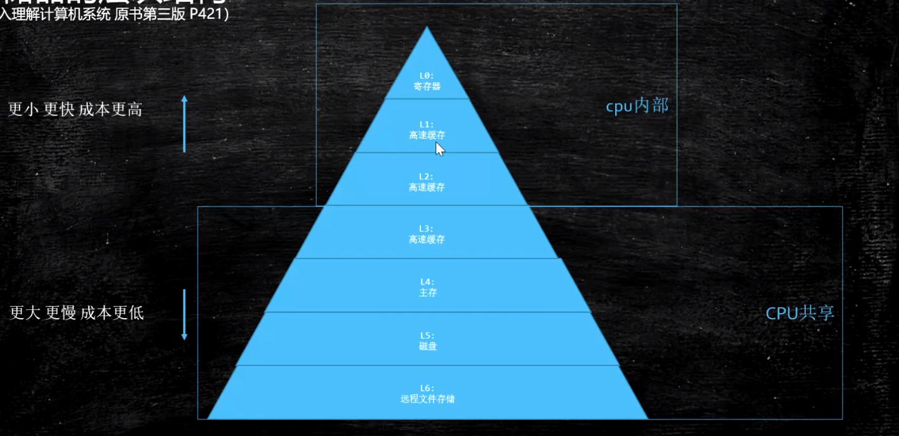

1. 硬件层面:
    - CPU缓存与内存结构:
        
    - 现代cpu的数据一致性实现:
        - 缓存锁(Intel使用MESI协议) + 总线锁
            - MESI: CPU中每个缓存行使用4种状态进行标记
                - M: Modified, 当前CPU加载的部分是否已变化
                - E: Exclusive, 该缓存行只被缓存在该CPU的缓存中
                - S: Shared，该缓存行可能被多个CPU缓存
                - I: Invalid，该缓存是无效的，可能有其他CPU修改了该缓存行
            - cache line: CPU读取缓存的基本单位，一般为`64字节`
            - 伪共享问题:
                - CPU读取缓存时以`cache line`为单位，所以可能出现只需要`x`
                变量，却将相邻的`y`一起加载进`L1，L2 cache`的情况
                - 如果有一个`CPU`需要`x`，另一个`CPU`需要`y`，并且都会对相应
                变量进行修改；这时候两个`CPU`的修改就会相互之间互相影响
                - 解决:
                    - 在`x`之前和之后再补充字节，保证`x`与`y`之间缓存行的独立
                    - 即缓存行对齐
    - CPU重排序:
        - 重排序的本质:
            由于内存读取的速度远慢于CPU的执行速度，所以当前一条指令去
            读取内存时，后一条指令如果跟前一条指令没有关系，并且后一条
            指令可以马上执行的话，CPU就会马上去执行下一条指令， 这时候
            就发生了指令重排序的问题
        - WCBuffer: 合并写缓存
            - 是一个比`L1 Cache`更快的缓存
            - 在`CPU`进行内存写操作时，会将多个单位的写操作合并到`WCBuffer`后，
            再一起写入内存
            - 数量很少，一般CPU只有四个该缓存
            - 拓展问题:
                - 执行`100_0000`次循环，每次需要对六个变量执行写操作，
                现给出两种方案:
                    - 每次循环同时对六个变量一起执行写操作
                    - 分成两次，每次各对三个变量一起执行写操作
                    - 注意，在对变量进行写之前，还会通过另外一个变量进行赋值操作
                问哪种更快？
                - 第二种，因为第二种恰好一次循环四个写操作，可以塞入`WCBuffer`一次性
                合并写入内存；而第一种可能有些循环塞不满`WCBuffer`,而需要等待下一次
                循环的变量赋值
        - 一个证明CPU会产生重排序的小程序:
            - 四个变量:
                a = b = x = y = 0;
            - 两个线程:
                - Thread1: a = 1; x = b;
                - Thread2: b = 1; y = a;
            - 理论上可能出现的情况:
                (x = 0, y = 1), (x = 1, y = 0), (x = 1, y = 1)
            - 实际上，发生了重排序，会出现:
                (x = 0, y = 0)
                
    - 硬件内存屏障(x86):
        - sfence: 写屏障，在sfence指令前的写操作当必须在sfence指令后的写操作前完成。
        - lfence: 读屏障，在lfence指令前的读操作当必须在lfence指令后的读操作前完成。
        - mfence: 读写屏障，在mfence指令前的读写操作当必须在mfence指令后的读写操作前完成。
    
2. JVM级别对屏障的规范:
    - LoadLoad: `Load1; LoadLoad; Load2`，`Load2`读取前要保证`Load1`数据读取完毕
    - StoreStore: `Store1; StoreStore; Store2`，`Store2`写入前要保证`Store1`数据写入完毕
    - LoadStore: `Load1; LoadStore; Store2`，`Store2`写入前要保证`Load1`数据读取完毕
    - StoreLoad: `Store1; StoreLoad; Load2`，`Load2`读取前要保证`Store1`数据写入完毕
    
3. volatile实现细节:
    - 字节码层面: access_flags - ACC_VOLATILE
    - JVM层面:
        > StoreStoreBarrier
        > volatile写
        > StoreLoadBarrier
            
        > LoadLoadBarrier
        > volatile读
        > LoadStoreBarrier
    - OS及硬件层面:
        - x86: sfence, lfence, mfence + lock
        - lock指令:
            使用在指令之上，会锁定后序指定使用的内存块；
        - cmpxchg: compareAndExchange，CAS指令

4. synchronized实现细节:
    - 字节码层面:
        - ACC_SYNCHRONIZED: 方法
        - monitorenter, monitorexit: 代码块
    - JVM层面:
        - C，C++ 调用了操作系统提供的同步机制
        - OS和硬件层面:
            lock cmpxchg/xxx