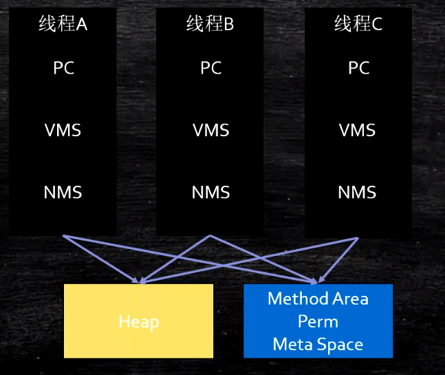

JVM各部分内存结构，指令集:
1. Java内存区域:
    
    - PC: 
        - 存放指令的位置
        - ````
            while(not end) {
                取PC位置的指令;
                执行该指令;
                PC ++; 
            }
          ````
    - JVM Stack: 虚拟机栈
        - 存储内容: 栈帧
        - 栈帧结构:
            - 局部变量表
            - 操作数栈
            - Dynamic Linking: 指向运行时常量池的引用
            - return address: 方法返回地址，将返回值塞到上一个栈帧
    - Heap:
    - Method Area:
        - Perm Space: 
            - <= jdk1.7
            - 字符串常量池位于此区域
            - FGC不会清理
            - 大小启动的时候指定，不能改变
        - Meta Space:
            - \>= jdk1.8
            - 会触发FGC
            - 不设定的话，最大就是物理内存
    - Runtime Constant Pool:
        运行时常量池，就是存储class文件中那些Constant的内存区域
    - Native Method Stack:
        对应于JVM虚拟机栈，此栈专门用于执行`native`方法
    - Direct Memory:
        - JVM可以直接访问的内核空间的内存(OS管理的内存)
        - NIO，提高效率，实现`zero copy`
        
2. 两种经典的实现指令集的方式:
    - 基于栈的指令集: JVM指令集采用此方式实现
    - 基于寄存器的指令集: CPU指令集都是这种方式实现
    - 两种实现方式的共同之处:
        - 可以将栈看作是第二种方式的内存，而将每个局部变量看作寄存器

3. 常用指令:
    - _store: 将栈中值弹出，并赋值给变量
    - _load: 将变量值load到栈中
        - iload_2: 将整形变量，其编号在局部变量表中为2，load进操作数栈
        - aload_2: 将object变量，其编号在局部变量表中为2，load进操作数栈
    - pop: _store的简化版本，不赋值给变量，但是会将值弹出栈
    - mul: 将栈顶两元素弹出做乘法
    - sub: 将栈顶两元素弹出做减法，被减数为栈顶元素，减数为第二个
    - invoke系列指令:
        - invokeStatic: 调用静态方法时，使用此指令
        - invokeVirtual: 调用成员变量的方法时，使用此指令
        - invokeSpecial: 调用构造函数/成员变量private方法时，使用此指令
        - invokeInterface: 调用接口变量方法时
        - invokeDynamic: 
            - lambda表达式
            - 反射
            - 其它动态语言: scala, kotlin
            - CGLib, ASM, 动态产生的代理类
            - 以上四种情况会使用到该指令