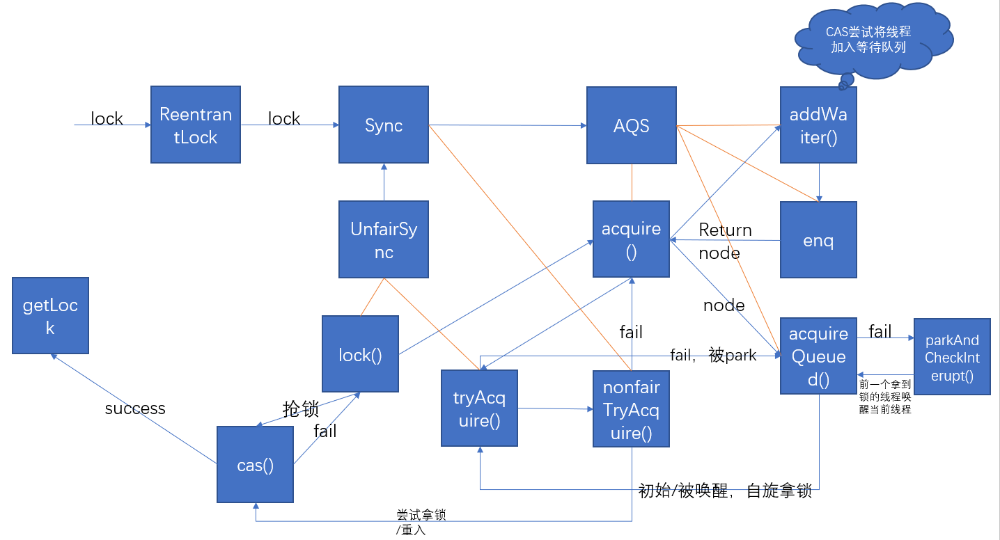
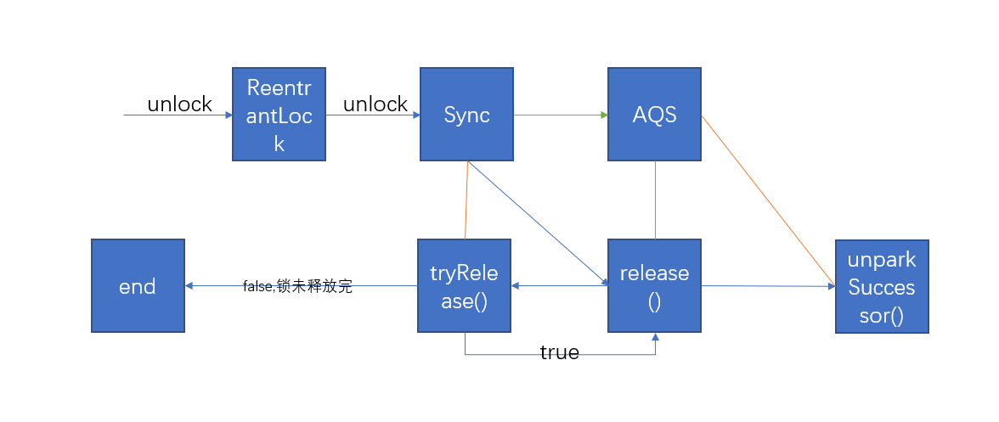
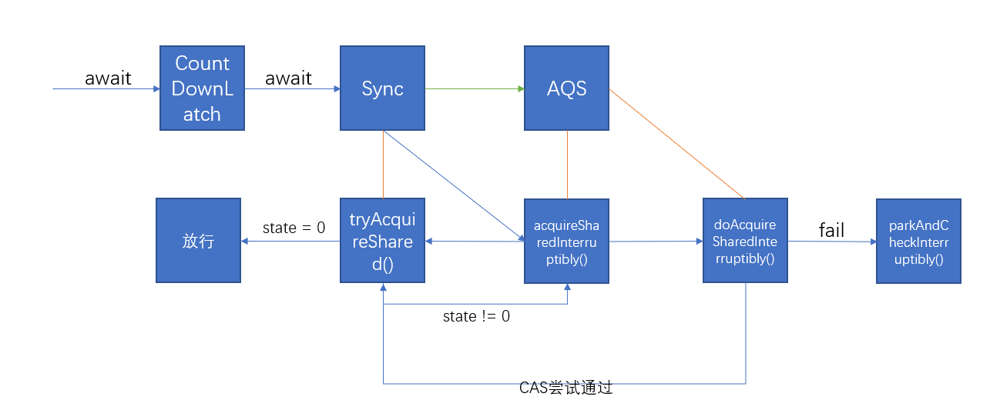
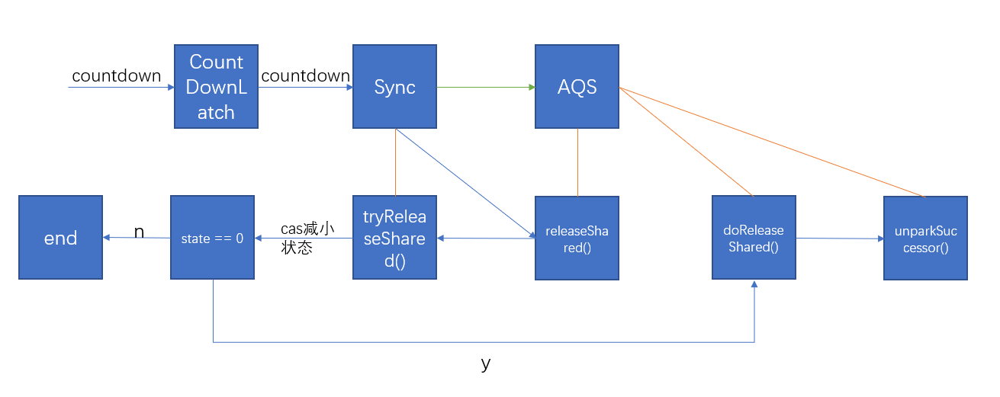

1. ReentrantLock非公平锁`lock`, `unlock`方法解读
    
    - 调用内部类`NonfairSync`的lock方法
    - 转移到`AQS`的`acquire`方法
        - 内部类`tryAcquire`
        - `AQS`的`addWaiter`将线程添加进等待队列
        - `AQS`的`acquireQueued`使用 cas抢锁/挂起线程
    
    - 调用内部类`AQS`的`release`方法
        - 调用内部类`Sync`的`tryRelease`方法，释放锁
        - 若成功释放锁，则执行`unparkSuccessor`唤醒后面线程
    
2. `CountDownLatch`中`await`, `countdown`方法解读
    
    