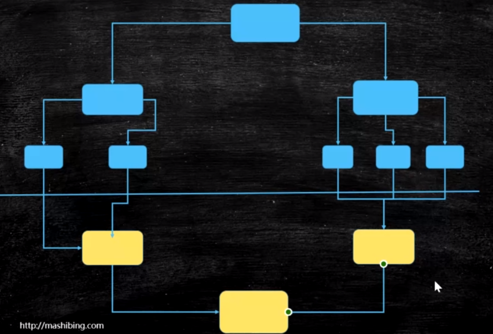

1. ForkJoinPool:
    
    - 使用:
        - 传入的任务需要是`ForkJoinTask`类型
            - RecursiveAction: 无返回值
            - RecursiveTask: 有返回值
            - 实现`compute`方法，并使用`fork`进行任务划分，
            `join`进行值合并
        - WorkStealingPool
            - `ForkJoinPool`的一种
            - 每个线程单独维护一个自己的任务队列，当某个
            线程任务执行完成之后，可以到别的线程任务队列中
            偷取任务执行