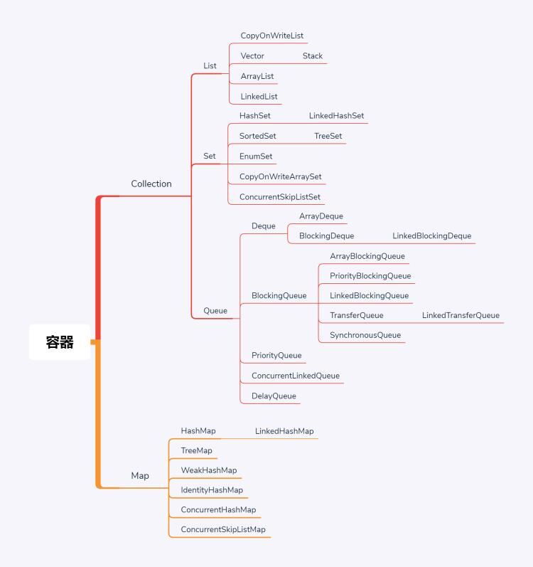

1. Java容器汇总:
    
    - Map相关:
        - HashTable: 早期HashMap，所有方法都加`synchronized`
        - HashMap: 并发不安全容器
        - SynchronizedHashMap: 通过`Collections`将普通`HashMap`转化为
        并发安全容器
        - ConcurrentHashMap: 通过`CAS`保证并发安全，高并发读很快
        - ConcurrentSkipListMap: 有序的并发安全Map
    - List相关:
        - Vector: 早期并发安全容器，所有方法都加`synchronized`
        - CopyOnWriteList: 写时复制，在对容器进行写操作时，会加锁；
        但是读时，不加锁；意味着可以随意读，而写只有一个能写
    - Queue相关:
        - 提供接口:
            - add: 添加元素，满时抛异常
            - offer: 添加元素，满时返回false
            - poll
            - peek
        - ConcurrentLinkedQueue: 并发安全，底层由链表实现的`Queue`
        - BlockingQueue: 额外提供阻塞方法: `put`, `take`
            - ArrayBlockingQueue: 可指定大小
            - SynchronusQueue: 大小为0，很像golang中的channel
            - TransferQueue:
                - transfer: 与`put`很相似，但`put`当能装进阻塞队列时，
                会继续向下执行；而`transfer`会一直等待到当前`transfer`进
                队列的元素被人拿了，才会继续向下执行