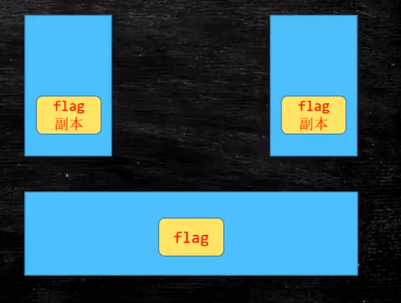

1. `synchronized`使用与原理:
    - 一般不要用于`String, Integer, Long`等基础类型包装类
    - 每个对象的对象头(mark word)都有2位用来标记锁，当某线程
    持有`synchronized`锁时，会使用这两位
    - `synchronized`锁升级过程:
        - 偏向锁: 当只有一个线程持有此锁时，使用偏向锁
        - 自旋锁: 当发生锁争用时，不持有锁的线程会进行自旋，默认10次进入下一阶段
        - 重量级锁: 当自旋10次后并且仍未获取锁时，会请求内核态，将锁升级为重量级锁
    - 加在类方法与类静态方法上的`synchronized`:
        - 类方法: 相当于 `synchronized(this)`
        - 静态方法: 相当于 `synchronized(xxx.class)`
    
2. `volatile`:
    - 保证可见性，禁止重排序
    - 可见性保证:
        
        - 硬件级别的保障:
            - MESI协议: 缓存行协议
                - M: Modified，表示当前CPU修改了相应缓存行
                - E: Exclusive, 表示当前CPU独占此缓存行
                - S: Shared, 表示当前CPU与其它CPU共享此缓存行
                - I: Invalid, 表示当前CPU相应缓存行被其它CPU修改，需要重新load
                - 可能出现**伪共享**问题
        - JVM内存屏障
            - 在`volatile`写操作前加`StoreStoreBarrier`, 写操作后
            加`StoreLoadBarrier`
            - 在`volatile`读操作前加`LoadLoadBarrier`, 读操作后
            加`LoadStoreBarrier`
    - 禁止重排序:
        - 重排序:
            - CPU为了提高程序运行效率，会进行一些指令优化
            - 比如，一条指令需要读取内存之后才能继续执行，那为何
            不在这条指令去进行IO的过程，继续执行下面与此指令无关的
            指令呢
        - 经典例子: 单例模式的双重检查写法
     
3. CAS自旋锁，乐观锁:
    - Compare And Set
    - CPU原语支持
    - 可能产生ABA问题:
        - 基本对象类型无大碍
        - Object可能产生问题
            - 假设对象o发生了ABA问题
            - o中的某个属性(Object类型)，在B的过程
            指向新的对象；这时候可能产生奇怪的错误
        - 解决:
            - 加version
            - Java中的原子类: `AtomicStampedReference`有版本号加持
            
4. Unsafe类:
    - 直接操作内存:
        - allocateMemory
        - putXX
        - freeMemory
        - pageSize
    - 直接生成类实例:
        - allocateInstance
    - 直接操作类或实例变量:
        - objectFieldOffset
        - getInt
        - getObject
    - CAS相关操作:
        - jdk1.8: compareAndSwapxxx
        - jdk11: weakCompareAndSetxxx
            - 强引用: 只要强引用关系还存在，永远不会对此对象进行GC
            - 弱引用: 在即将发生内存溢出前，会将这些对象进行GC
            - 软引用: 生存到下一次GC为止
            - 虚引用: 不会对对象的生存造成任何影响，但会在回收前给出一个系统通知
    