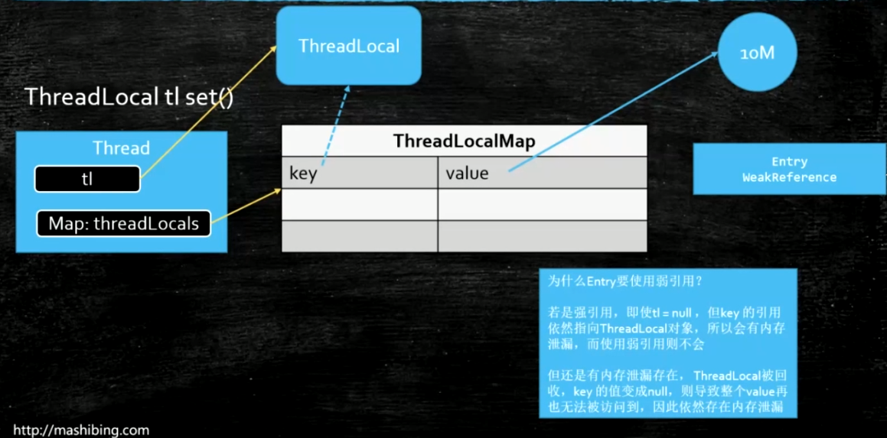

1. ThreadLocal底层原理:
    - Thread: 维护一个自己的`ThreadLocalMap`: threadLocals
    - ThreadLocalMap: ThreadLocal的内部类
    - ThreadLocal: 普通类
    
2. ThreadLocal的`set`方法:
    ````java
       public void set(T value) {
               Thread t = Thread.currentThread();
               ThreadLocalMap map = getMap(t);
               if (map != null)
                   map.set(this, value);
               else
                   createMap(t, value);
       }
    ````
   - 首先获取当前线程的`threadLocals`
   - 然后将当前的`ThreadLocal`对象作为`key`，用户要存储的值作为
   `value`，存储进当前线程的`threadLocals`
   
3. `ThreadLocalMap`中`Entry`为什么要做成`WeakReference`？并且`WeakReference`中放置的引用是`key`?
    
    - `ThreadLocal`对象可能是外部的一个局部变量，离开局部代码块
    之后可能会变成垃圾，在用户眼中应该成为一个垃圾；
    - 而如果`Entry`的`key`(即`ThreadLocal`对象)没有被做成弱引用，
    则可能会导致内存泄漏；因为`ThreadLocal`仍然被`Entry`中的`key`所引用
   
4. `ThreadLocal`用完之后要`remove`
    - 不然可能产生内存泄漏
    - 因为在大型应用中，线程是放在线程池中可以多次使用的。
    因此`ThreadLocal`的`value`在其它场景下可能并不需要，
    这时候会导致`Entry`(即`WeakReference`对象)无法回收
    而造成内存泄漏
    